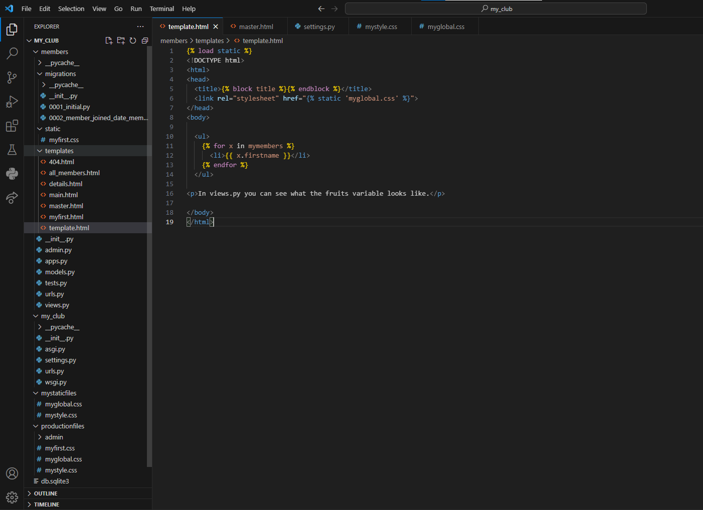

# Personal Week Log

- Applicable date range
- Type of tasks you worked on (screenshot from Peer Eval question)
- Recap on your week's goals-Which features were yours in the project plan for this milestone?
  - Which tasks from the project board are associated with these features?
  - Among these tasks, which have you completed/in progress in the last week?
  - Optional text: Additional context that we should be aware of

# Preferred name -> Ssc name -> Github name

- Adrian -> Adrian Fong -> AdrianFWM

## Week 4 2023/09/25~2023/10/1

- Task I have worked on this week.

## Recap on your week's goals

- Worked on project plan document, distribute work evenly, my own weekly log, contribute to team weeklog.

# Preferred name -> Ssc name -> Github name

- Adrian -> Adrian Fong -> AdrianFWM

## Week 5 2023/10/2~2023/10/7

- Task I have worked on this week.

## Recap on your week's goals

- Worked on "Learning Django basics and setup" from the project board, learning Django practices/exercises on w3schools website, I learned how to setup and modify Django files and make it into a local website. 
- Finding CSS template from online for our actual website.
- Worked on my own weekly log, contribute to team weeklog.
- Additional: Following images are the screenshot of the Django exercise website:

- Django code and files

- Home Page

- Member List Page

- Member Details Page

- Admin Page

# Preferred name -> Ssc name -> Github name

- Adrian -> Adrian Fong -> AdrianFWM

## Week 6 2023/10/8~2023/10/14

- Task I have worked on this week.

## Recap on your week's goals

- Worked on "Setting up the project Django base" from the project board, setup the Django environment, Django database with website framework loaded.
- Working on "CSS dev" from project board, implemented some part of the css template files into Django environment.
- Working on "Home page" on project board, connect the our Home page into Django environment, so when the Django loaded up, it shows our home page.
- Worked on my own weekly log, contribute to team weeklog.
- Additional: Following images are the screenshot of the Django environment website and home page with CSS layout website:

Home Page

Video Page

# Preferred name -> Ssc name -> Github name

- Adrian -> Adrian Fong -> AdrianFWM

## Week 7 2023/10/15~2023/10/21

- Task I have worked on this week.

## Recap on your week's goals

- Working on "Login" and "Create Account" on project board, made the Login and Register Page with forms and connect the header buttons to the home page. The function submitting the login and register form to sql database are complete. Applied css and bootstrap files on Login and Register Page.
- Worked on remaking the form functions in Django for css style and sql database layout in Login and Register Page.
- Working on the website logo, which will be applied on the top corner of the website, and on top of the login form. 
- Working on slogan on the right side of the login form.
- Working on remaking the header bar from home page.
- Worked on my own weekly log, contribute to team weeklog.
- Additional: Following images are the screenshot of the Login and Register Page:

Login Page

Register Page
