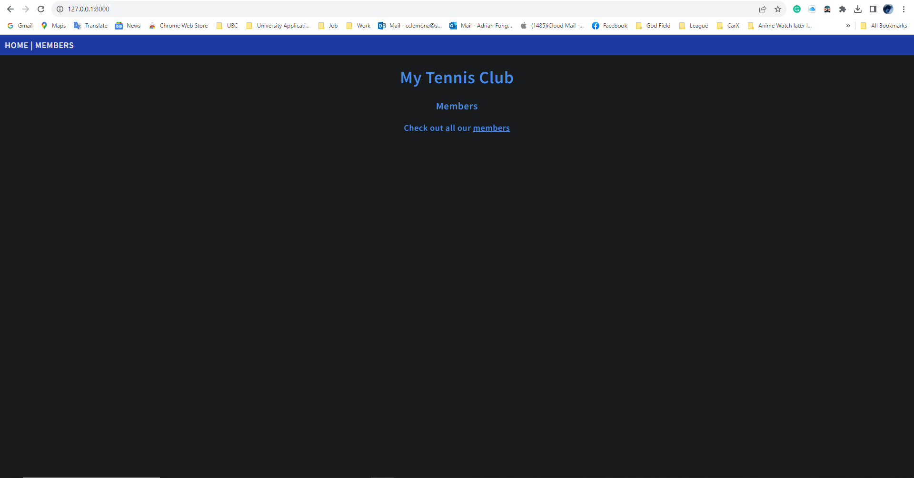
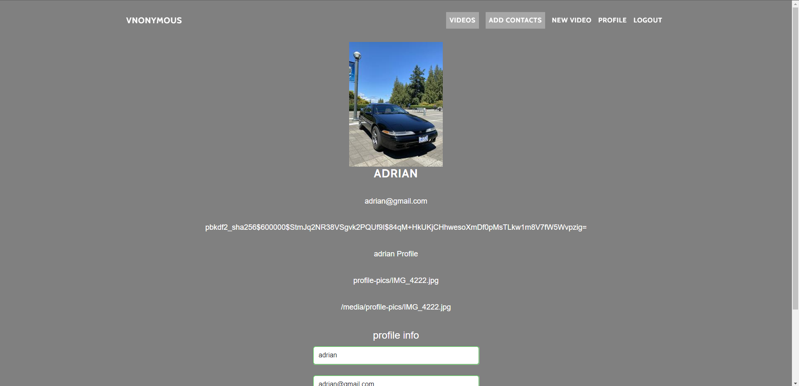

# Personal Week Log

- Applicable date range
- Type of tasks you worked on (screenshot from Peer Eval question)
- Recap on your week's goals-Which features were yours in the project plan for this milestone?
  - Which tasks from the project board are associated with these features?
  - Among these tasks, which have you completed/in progress in the last week?
  - Optional text: Additional context that we should be aware of

# Preferred name -> Ssc name -> Github name

- Adrian -> Adrian Fong -> AdrianFWM

## Week 4 2023/09/25~2023/10/1

- Task I have worked on this week.

## Recap on your week's goals

- Worked on project plan document, distribute work evenly, my own weekly log, contribute to team weeklog.

# Preferred name -> Ssc name -> Github name

- Adrian -> Adrian Fong -> AdrianFWM

## Week 5 2023/10/2~2023/10/7

- Task I have worked on this week.

## Recap on your week's goals

- Worked on "Learning Django basics and setup" from the project board, learning Django practices/exercises on w3schools website, I learned how to setup and modify Django files and make it into a local website.
- Finding CSS template from online for our actual website.
- Worked on my own weekly log, contribute to team weeklog.
- Additional: Following images are the screenshot of the Django exercise website:

- Django code and files

- Home Page

- Member List Page

- Member Details Page

- Admin Page

# Preferred name -> Ssc name -> Github name

- Adrian -> Adrian Fong -> AdrianFWM

## Week 6 2023/10/8~2023/10/14

- Task I have worked on this week.

## Recap on your week's goals

- Worked on "Setting up the project Django base" from the project board, setup the Django environment, Django database with website framework loaded.
- Working on "CSS dev" from project board, implemented some part of the css template files into Django environment.
- Working on "Home page" on project board, connect the our Home page into Django environment, so when the Django loaded up, it shows our home page.
- Additional: Following images are the screenshot of the Django environment website and home page with CSS layout website:

Home Page

Video Page

# Preferred name -> Ssc name -> Github name

- Adrian -> Adrian Fong -> AdrianFWM

## Week 7 2023/10/15~2023/10/21

- Task I have worked on this week.

## Recap on your week's goals

- Working on "Login" and "Create Account" on project board, made the Login and Register Page with forms and connect the header buttons to the home page. The function submitting the login and register form to sql database are complete. Applied css and bootstrap files on Login and Register Page.
- Worked on remaking the form functions in Django for css style and sql database layout in Login and Register Page.
- Working on the website logo, which will be applied on the top corner of the website, and on top of the login form.
- Working on slogan on the right side of the login form.
- Working on remaking the header bar from home page.
- Worked on my own weekly log, contribute to team weeklog.
- Additional: Following images are the screenshot of the Login and Register Page:

Login Page

Register Page

# Preferred name -> Ssc name -> Github name

- Adrian -> Adrian Fong -> AdrianFWM

## Week 8 2023/10/22~2023/10/28

- Task I have worked on this week.

## Recap on your week's goals

- Worked on "Login" and "Create Account" on project board, finished working on Login and Register Page with forms and connect headers with other pages. The form function of submitting information from the Login and Register Page to the SQL database. The error message shown after input wrong information or user on Login and Register Page. Reapplied css and bootstrap file formats on Login and Register Page to match the theme with the other Pages.
- Worked on reworking the whole website theme for Login and Register Page.
- Worked on applying animated website logo onto the website, especially on Login Page.
- Worked on applying new images to match the theme on Login and Register Page.
- Worked on remaking the Video Page and Search Page.
- Worked on remaking header bar and applied it onto all other pages.
- Worked on testing the Login and Register Page manually and see if there are errors or not.
- Worked on my own weekly log, contribute to team weeklog.
- Additional: Following images are the screenshot of the whole website:

Home Page

Video Page

Search Page

Login Page

Login Error Page

Register Page

Register Error Page

# Preferred name -> Ssc name -> Github name

- Adrian -> Adrian Fong -> AdrianFWM

## Week 9 2023/10/29~2023/11/04

- Task I have worked on this week.

## Recap on your week's goals

- Worked on fixing the header on Video and Search Page.
- Worked on Upload, Profile, Logout Page, adding header bar, css layout, and imported working function on successful upload video post.
- Worked on Edit Profile form function working on Profile Page, modified Django form to match css and SQL database.
- Worked on fixing error on Profile Page of not updating the profile information after filling the form.
- Worked on "Presentation prep" on project board, we wrote a script, dividing presentation work, and assigning presentation part to everyone.
- Worked on grading, comment, and watch other group's presentation.
- Worked on my own weekly log, contribute to team weeklog.
- Additional: Following images are the screenshot of the whole website:

Video Page

Search Page

Upload Page

Upload Page (Uploading Video)

Video Page (Upload Success)

Profile Page

Logout Page

Presentation Prep Script part 1

Presentation Prep Script part 2

# Preferred name -> Ssc name -> Github name

- Adrian -> Adrian Fong -> AdrianFWM

## Week 10 2023/11/05~2023/11/11

- Task I have worked on this week.

## Recap on your week's goals

- Worked on drawing UML diagram for SQL database restructure.
- Working on drawing webpage road map.
- Worked on "Edit Profile", it can upload profile picture, able to change profile picture refresh webpage, change username if username is unused, change email, and change password.
- Working on finding template for profile page.
- Planning on making another webpage for changing password.
- Worked on my own weekly log, contribute to team weeklog.
- Additional: Following images are the screenshot of the whole website:

Edit Profile Page

Fillin Edit Profile

Back to Login Page

Profile Upload Successful

UML for SQL Database

## Week 11/12 2023/11/12~2023/11/26

- Task I have worked on this week.

## Recap on your week's goals

### Edit Profile Page/Testing
- Worked on "Edit Profile" on project board, new Edit Profile template with functioning forms updated, user are able to change username, email, profile picture, and update after clicking the "update" button.
 
- [Edit Profile Page/Testing Pull Request](https://github.com/COSC-499-W2023/year-long-project-team-13/pull/70)
 
 
Edit Profile Page

Edit Profile Page Form Function

- Worked on Edit Profile test, it successfully runs and check for changing user profile information after updating, it also can run with other tests with no error.
 
 
Edit Profile Testing

### Admin Page/Testing
- Worked on "Admin" on project board, it will only be avaliable if the user's account is an admin. In admin page, the admin user is able to view and change SQL database information, and change admin password. Admin page is able to link back to home page and logout page after click the right top page link button.
 
- [Admin Page Pull Request/Commit](https://github.com/COSC-499-W2023/year-long-project-team-13/pull/69)
 
 
Admin Page

- Worked on Admin test, it runs successfully and check the admin button shows up if admin user has logged in and check if the admin page link with other pages. It is also running with other test with no error.
 
- [Admin Test Pull Request/Commit](https://github.com/COSC-499-W2023/year-long-project-team-13/pull/72)
 
 
Admin Testing

### Logout UI/Testing (In Progress)
- Working on "Logout" on project board, it is still in progress, the logout UI shows up after clicking the logout button on header bar. Every button on UI is functional and work on every webpage.
- Worked on Logout Testing for this current stage Logout, it successfully runs.
 
- [Logout Page/Testing Pull Request](https://github.com/COSC-499-W2023/year-long-project-team-13/pull/71)
 
 
Logout UI

Logout Testing

### Top Header Page (Updated)
- Worked on creating new button on top header bar for "Admin", "Profile", and "Logout" with successful linking to other pages, it sucessfully tested on test home page file.
 
 
Logout UI

### Review Pull Request
- Worked on review other people's code in pull requests, approved and merged Ethan's Add Contact Page request.
 
- [Add Contacts Pull Request](https://github.com/COSC-499-W2023/year-long-project-team-13/pull/74)
 
 
Review Pull Request Screenshot

### Deciding on Task Priorities/Assigning Other People Task
- Worked on deciding task priorities, because presentation video is coming up next week, so we decide to work on pages that does not have a template, so we can have all website pages with correct templates.
- Worked on assigning other people on working page layout template, such as: Beth working on "Create Video Page", Ethan working on "View Video Page".
- Worked on my own weekly log, contribute to team weeklog.
- Additional: Following images are the screenshot of the whole website testing:
 
 
Whole Website Test

