# Personal Week Log

- Applicable date range
- Type of tasks you worked on (screenshot from Peer Eval question)
- Recap on your week's goals-Which features were yours in the project plan for this milestone?
  - Which tasks from the project board are associated with these features?
  - Among these tasks, which have you completed/in progress in the last week?
  - Optional text: Additional context that we should be aware of

# Preferred name -> Ssc name -> Github name

- Adrian -> Adrian Fong -> AdrianFWM

## Week 4 2023/09/25~2023/10/1

- Task I have worked on this week.
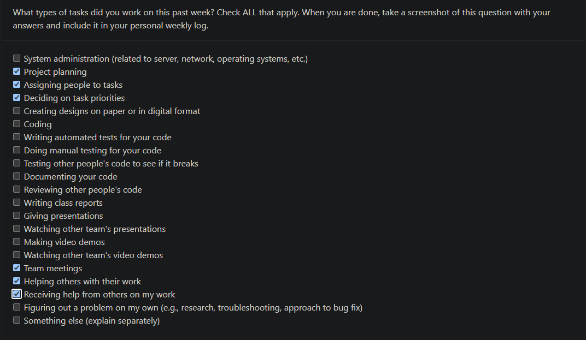

## Recap on your week's goals

- Worked on project plan document, distribute work evenly, my own weekly log, contribute to team weeklog.

# Preferred name -> Ssc name -> Github name

- Adrian -> Adrian Fong -> AdrianFWM

## Week 5 2023/10/2~2023/10/7

- Task I have worked on this week.

## Recap on your week's goals

- Worked on "Learning Django basics and setup" from the project board, learning Django practices/exercises on w3schools website, I learned how to setup and modify Django files and make it into a local website.
- Finding CSS template from online for our actual website.
- Worked on my own weekly log, contribute to team weeklog.
- Additional: Following images are the screenshot of the Django exercise website:

- Django code and files

- Home Page

- Member List Page
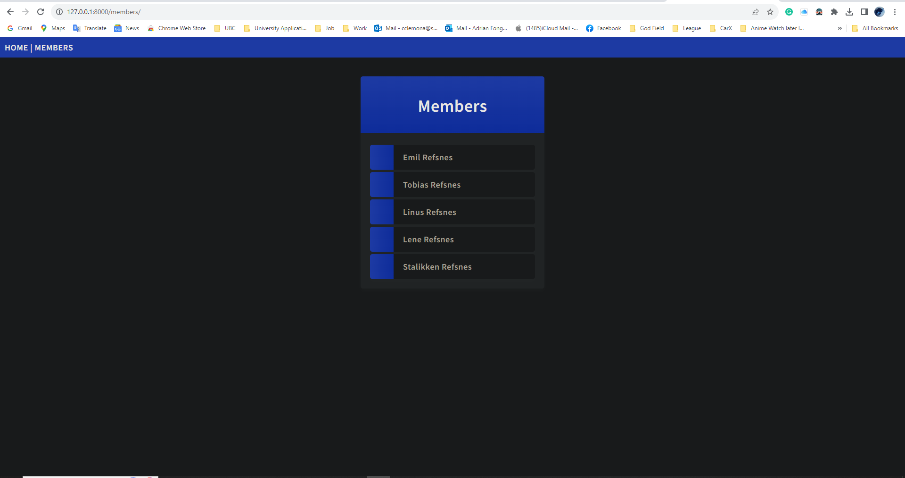

- Member Details Page

- Admin Page

# Preferred name -> Ssc name -> Github name

- Adrian -> Adrian Fong -> AdrianFWM

## Week 6 2023/10/8~2023/10/14

- Task I have worked on this week.
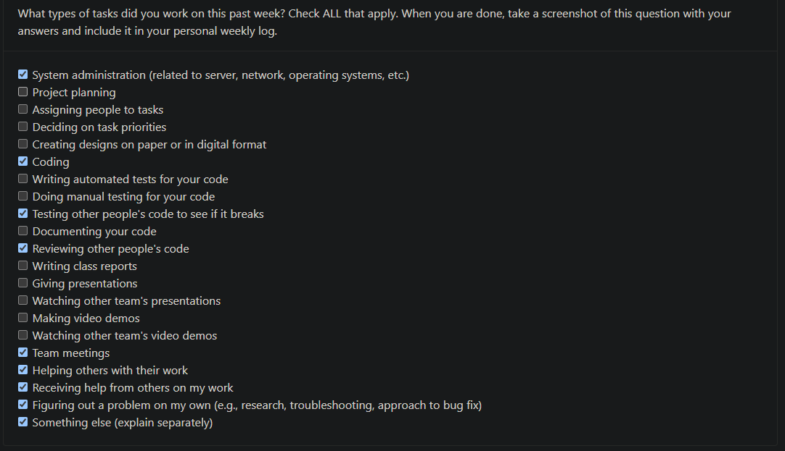

## Recap on your week's goals

- Worked on "Setting up the project Django base" from the project board, setup the Django environment, Django database with website framework loaded.
- Working on "CSS dev" from project board, implemented some part of the css template files into Django environment.
- Working on "Home page" on project board, connect the our Home page into Django environment, so when the Django loaded up, it shows our home page.
- Additional: Following images are the screenshot of the Django environment website and home page with CSS layout website:

Home Page

Video Page

# Preferred name -> Ssc name -> Github name

- Adrian -> Adrian Fong -> AdrianFWM

## Week 7 2023/10/15~2023/10/21

- Task I have worked on this week.

## Recap on your week's goals

- Working on "Login" and "Create Account" on project board, made the Login and Register Page with forms and connect the header buttons to the home page. The function submitting the login and register form to sql database are complete. Applied css and bootstrap files on Login and Register Page.
- Worked on remaking the form functions in Django for css style and sql database layout in Login and Register Page.
- Working on the website logo, which will be applied on the top corner of the website, and on top of the login form.
- Working on slogan on the right side of the login form.
- Working on remaking the header bar from home page.
- Worked on my own weekly log, contribute to team weeklog.
- Additional: Following images are the screenshot of the Login and Register Page:

Login Page

Register Page

# Preferred name -> Ssc name -> Github name

- Adrian -> Adrian Fong -> AdrianFWM

## Week 8 2023/10/22~2023/10/28

- Task I have worked on this week.
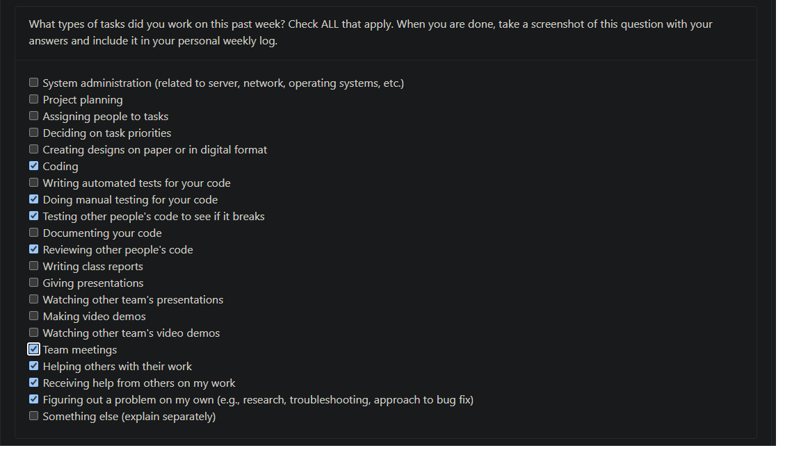

## Recap on your week's goals

- Worked on "Login" and "Create Account" on project board, finished working on Login and Register Page with forms and connect headers with other pages. The form function of submitting information from the Login and Register Page to the SQL database. The error message shown after input wrong information or user on Login and Register Page. Reapplied css and bootstrap file formats on Login and Register Page to match the theme with the other Pages.
- Worked on reworking the whole website theme for Login and Register Page.
- Worked on applying animated website logo onto the website, especially on Login Page.
- Worked on applying new images to match the theme on Login and Register Page.
- Worked on remaking the Video Page and Search Page.
- Worked on remaking header bar and applied it onto all other pages.
- Worked on testing the Login and Register Page manually and see if there are errors or not.
- Worked on my own weekly log, contribute to team weeklog.
- Additional: Following images are the screenshot of the whole website:

Home Page
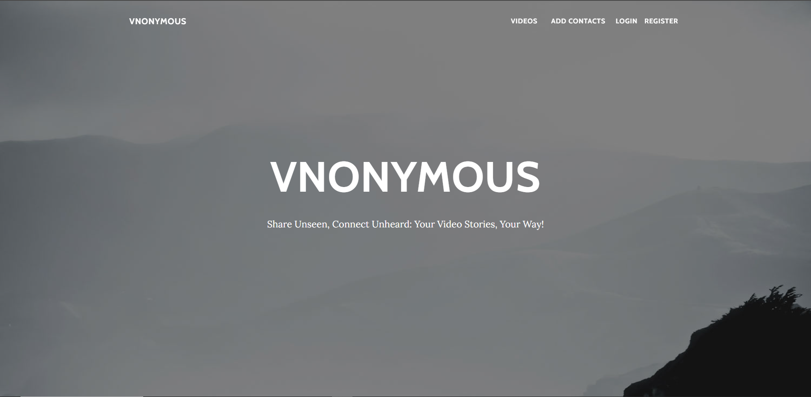

Video Page
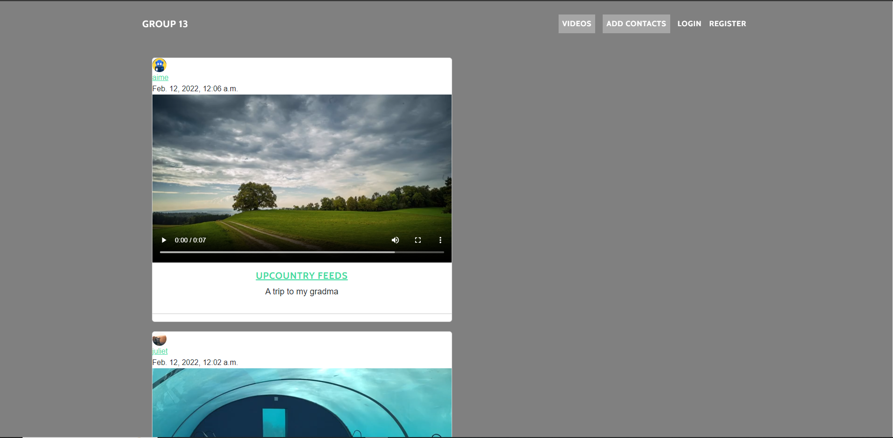

Search Page
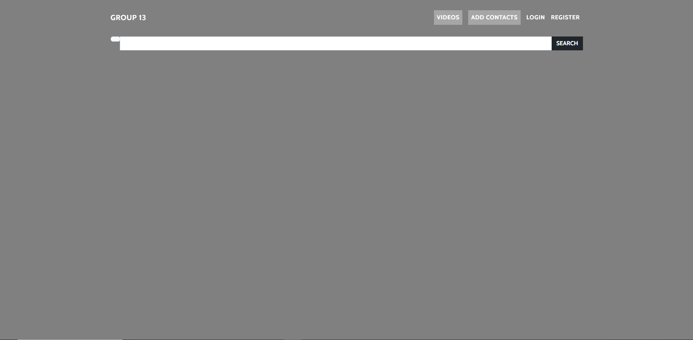

Login Page

Login Error Page

Register Page
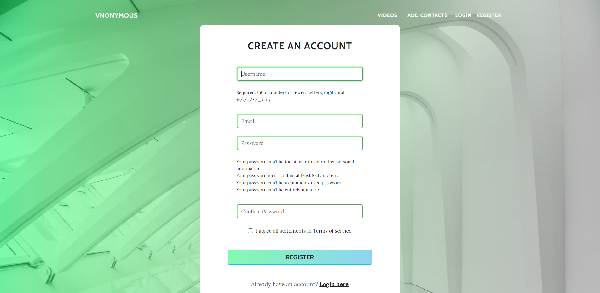

Register Error Page
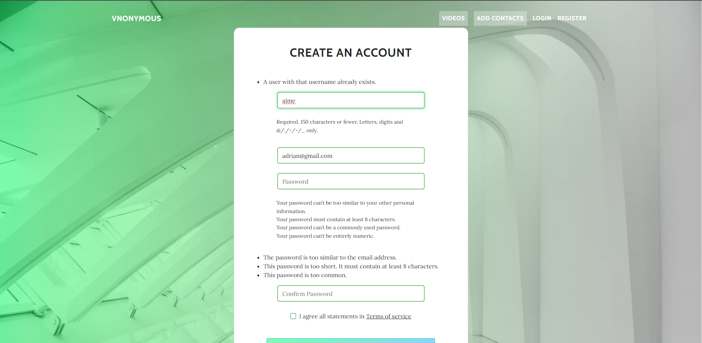

# Preferred name -> Ssc name -> Github name

- Adrian -> Adrian Fong -> AdrianFWM

## Week 9 2023/10/29~2023/11/04

- Task I have worked on this week.

## Recap on your week's goals

- Worked on fixing the header on Video and Search Page.
- Worked on Upload, Profile, Logout Page, adding header bar, css layout, and imported working function on successful upload video post.
- Worked on Edit Profile form function working on Profile Page, modified Django form to match css and SQL database.
- Worked on fixing error on Profile Page of not updating the profile information after filling the form.
- Worked on "Presentation prep" on project board, we wrote a script, dividing presentation work, and assigning presentation part to everyone.
- Worked on grading, comment, and watch other group's presentation.
- Worked on my own weekly log, contribute to team weeklog.
- Additional: Following images are the screenshot of the whole website:

Video Page

Search Page
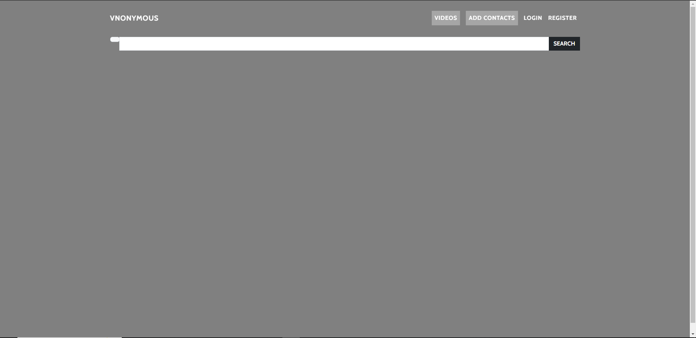

Upload Page

Upload Page (Uploading Video)

Video Page (Upload Success)

Profile Page

Logout Page
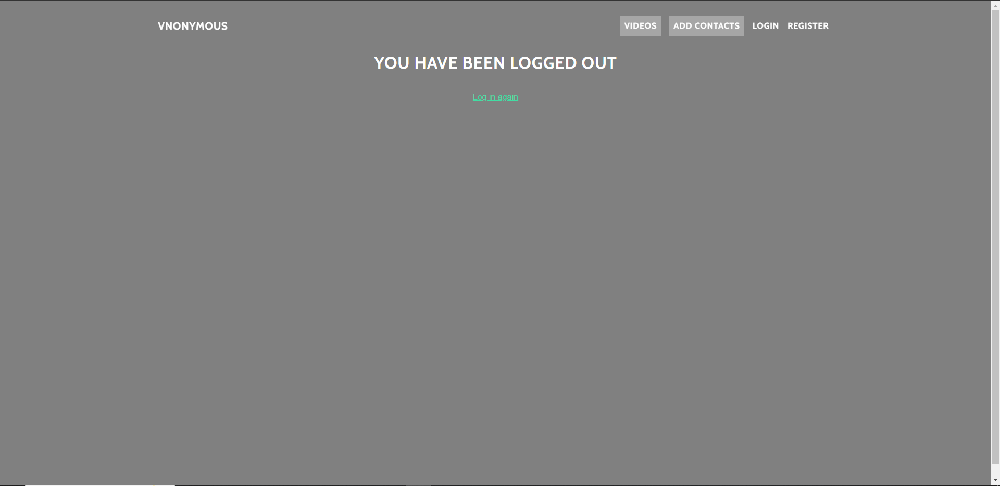

Presentation Prep Script part 1
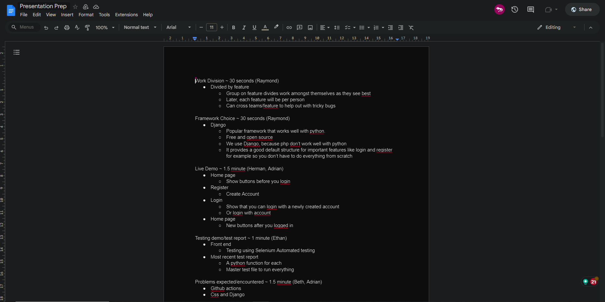

Presentation Prep Script part 2

# Preferred name -> Ssc name -> Github name

- Adrian -> Adrian Fong -> AdrianFWM

## Week 10 2023/11/05~2023/11/11

- Task I have worked on this week.
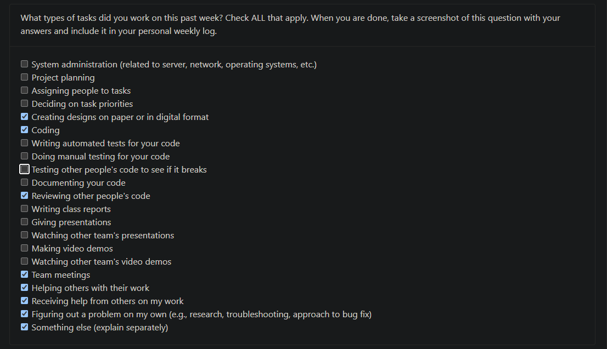

## Recap on your week's goals

- Worked on drawing UML diagram for SQL database restructure.
- Working on drawing webpage road map.
- Worked on "Edit Profile", it can upload profile picture, able to change profile picture refresh webpage, change username if username is unused, change email, and change password.
- Working on finding template for profile page.
- Planning on making another webpage for changing password.
- Worked on my own weekly log, contribute to team weeklog.
- Additional: Following images are the screenshot of the whole website:

Edit Profile Page

Fillin Edit Profile
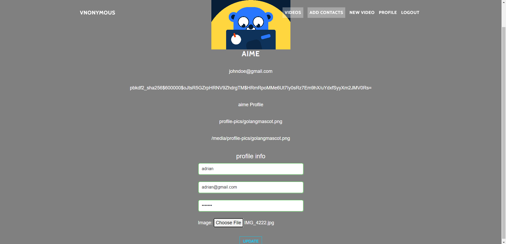

Back to Login Page

Profile Upload Successful

UML for SQL Database

# Preferred name -> Ssc name -> Github name

- Adrian -> Adrian Fong -> AdrianFWM

## Week 11/12 2023/11/12~2023/11/26

- Task I have worked on this week.
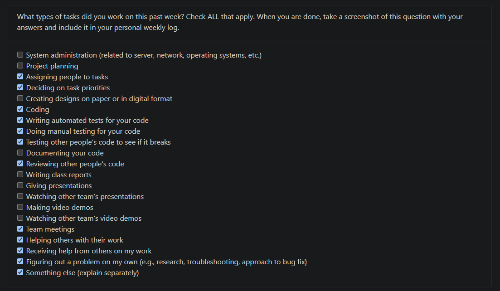

## Recap on your week's goals

### Edit Profile Page/Testing
- Worked on "Edit Profile" on project board, new Edit Profile template with functioning forms updated, user are able to change username, email, profile picture, and update after clicking the "update" button.
  - [Edit Profile Page/Testing Pull Request/Commit](https://github.com/COSC-499-W2023/year-long-project-team-13/pull/70)
  - Edit Profile Page

  - Edit Profile Page Form Function

- Worked on Edit Profile test, it successfully runs and check for changing user profile information after updating, it also can run with other tests with no error.
  - Edit Profile Testing Screenshot
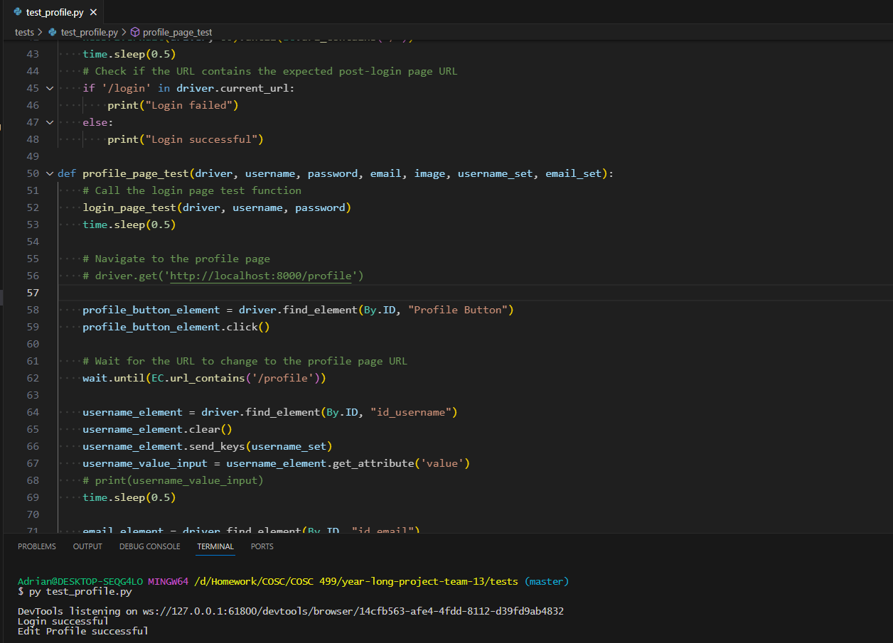

### Admin Page/Testing
- Worked on "Admin" on project board, it will only be avaliable if the user's account is an admin. In admin page, the admin user is able to view and change SQL database information, and change admin password. Admin page is able to link back to home page and logout page after click the right top page link button.
  - [Admin Page Pull Request/Commit](https://github.com/COSC-499-W2023/year-long-project-team-13/pull/69)
  - Admin Page Screenshot
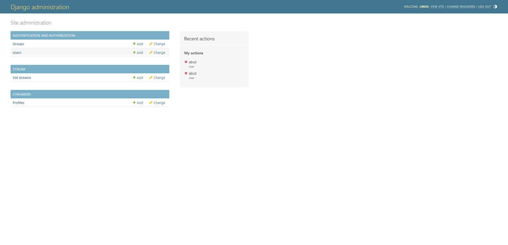
- Worked on Admin test, it runs successfully and check the admin button shows up if admin user has logged in and check if the admin page link with other pages. It is also running with other test with no error.
  - [Admin Test Pull Request/Commit](https://github.com/COSC-499-W2023/year-long-project-team-13/pull/72)
  - Admin Testing Screenshot

### Logout UI/Testing (In Progress)
- Working on "Logout" on project board, it is still in progress, the logout UI shows up after clicking the logout button on header bar. Every button on UI is functional and work on every webpage.
- Worked on Logout Testing for this current stage Logout, it successfully runs.
  - [Logout Page/Testing Pull Request](https://github.com/COSC-499-W2023/year-long-project-team-13/pull/71)
  - Logout UI Screenshot

  - Logout Testing Screenshot

### Top Header Page (Updated)
- Worked on creating new button on top header bar for "Admin", "Profile", and "Logout" with successful linking to other pages, it sucessfully tested on test home page file.
  - Header Screenshot
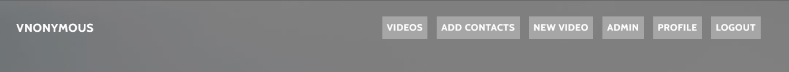

### Review Pull Request
- Worked on review other people's code in pull requests, approved and merged Ethan's Add Contact Page request.
  - [Add Contacts Pull Request](https://github.com/COSC-499-W2023/year-long-project-team-13/pull/74)
  - Review Pull Request Screenshot

### Deciding on Task Priorities/Assigning Other People Task
- Worked on deciding task priorities, because presentation video is coming up next week, so we decide to work on pages that does not have a template, so we can have all website pages with correct templates.
- Worked on assigning other people on working page layout template, such as: Beth working on "Create Video Page", Ethan working on "View Video Page".
- Worked on my own weekly log, contribute to team weeklog.
- Additional: Following images are the screenshot of the whole website testing:
  - Whole Website Test Screenshot
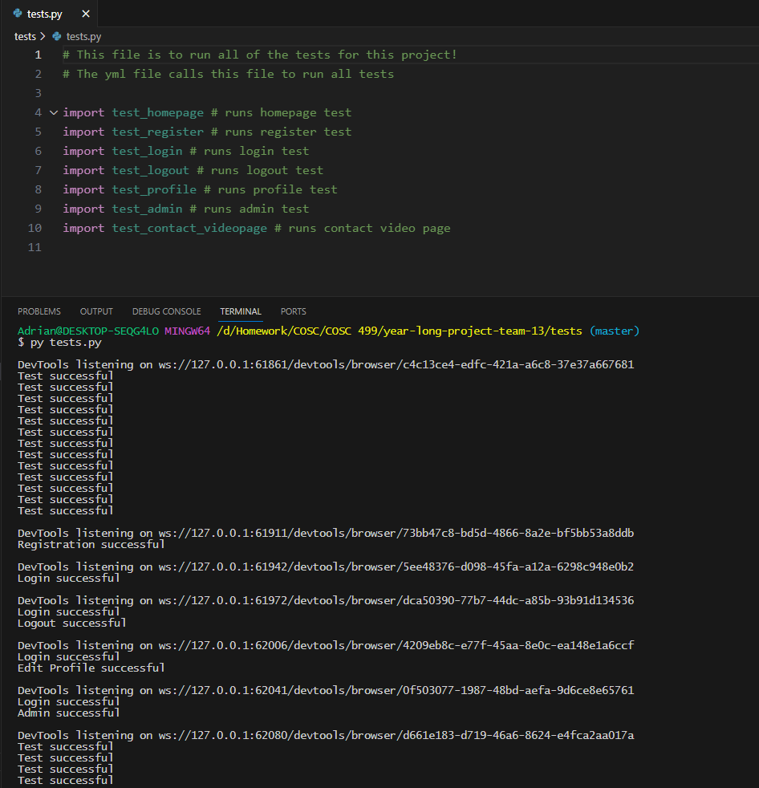

# Preferred name -> Ssc name -> Github name

- Adrian -> Adrian Fong -> AdrianFWM

## Week 13 2023/11/27~2023/12/03

- Task I have worked on this week.
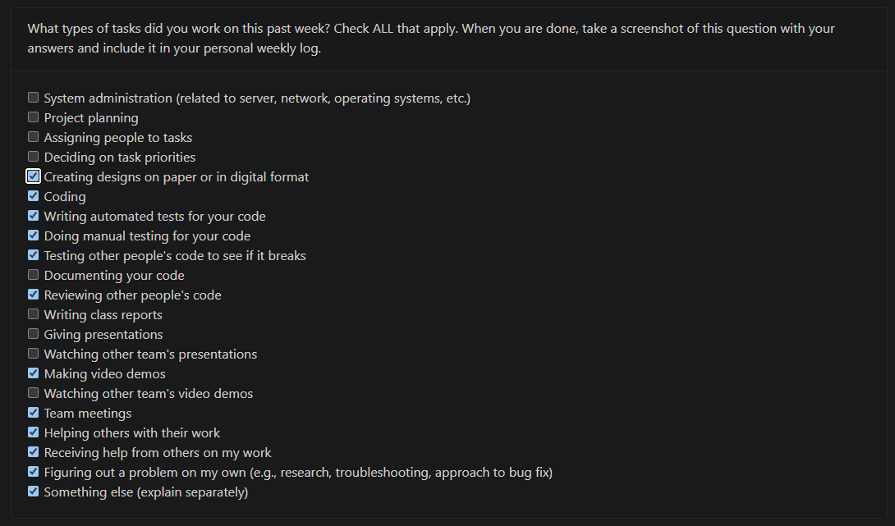

## Recap on your week's goals

### Edit Profile Page/Testing
- Worked on updating "Edit Profile" on project board, added "First Name" and "Last Name" in Django Form and replaced "Username" form because "Username" is our primary key in SQL database, so we decide not to change username instead users are able to change their "First Name" and "Last Name".
  - [Edit Profile Form Function Updated / Testing](https://github.com/COSC-499-W2023/year-long-project-team-13/pull/80)
  - New Edit Profile Page

  - New Edit Profile Page Form Function Updated

- Worked on Edit Profile test updated, it will check the same form from last week and also check the first and last name form profile user information as well, it can run with other tests with no error.
  - Edit Profile Testing Screenshot
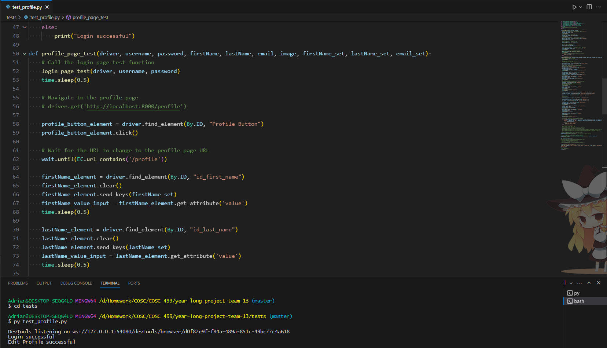

### Logout UI/Testing / Fix other page Logout
- Worked on "Logout" on project board, the logout page allow users to logout from any page after the user had logged in. After confirming by clicking the logout button, it will redirect to "Successful Logout" page, I modified this page to make it match the theme.
- Also, worked on fixing Notification Page cannot logout, it logs out now.
- The logout testing runs with no error,and work with other tests too.
  - [Logout Page Layout Updated](https://github.com/COSC-499-W2023/year-long-project-team-13/pull/81)
  - [Fixed Notification Page cannot logout](https://github.com/COSC-499-W2023/year-long-project-team-13/pull/85)
  - Logout Successful Screenshot
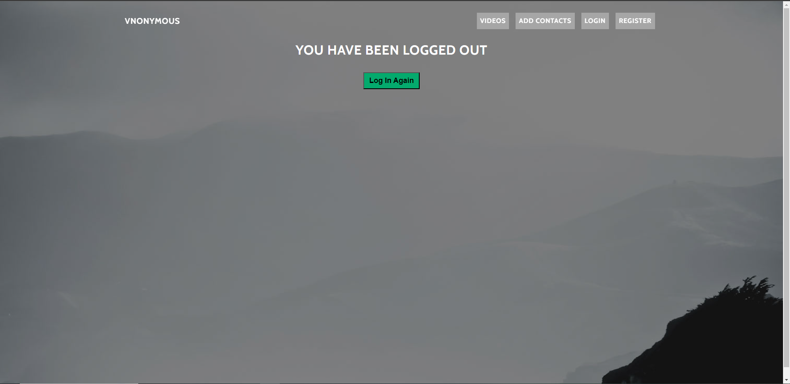
  - Logout Testing Screenshot

  - Notification Page Logout Fix Screenshot
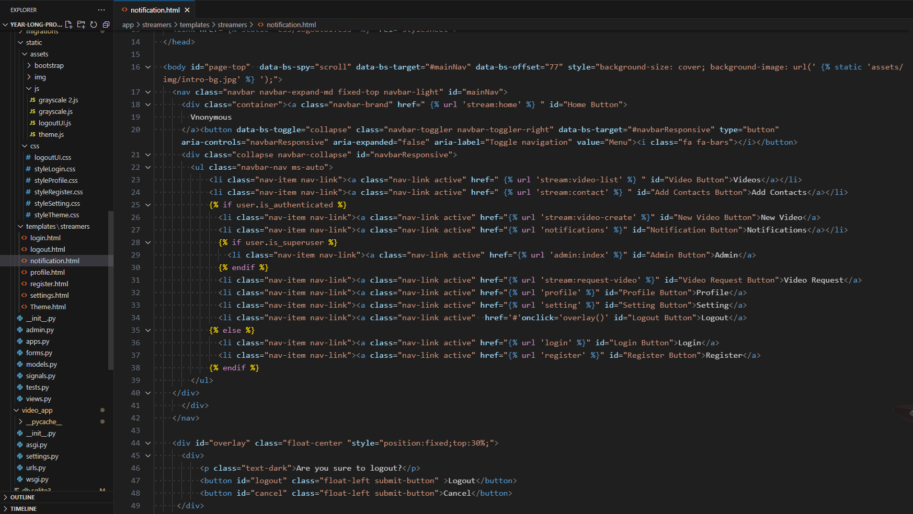

### Review Pull Request
- Worked on review other people's code in pull requests, approved and merged Herman's Notifications Page request, Sitt's Setting and Theme Page request, and Beth's Request Video Page request.
  - [Notifications Pull Request](https://github.com/COSC-499-W2023/year-long-project-team-13/pull/82)
  - Review Notifications Pull Request Screenshot
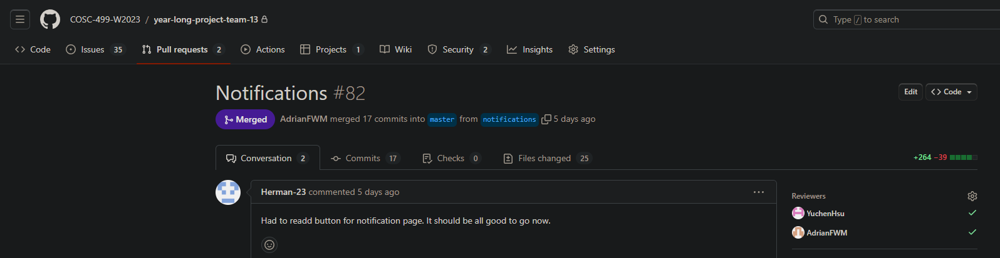
  - [Setting & Theme Pull Request](https://github.com/COSC-499-W2023/year-long-project-team-13/pull/84)
  - Review Setting & Theme Pull Request Screenshot

  - [Request Video Pull Request](https://github.com/COSC-499-W2023/year-long-project-team-13/pull/86)
  - Review Request Video Pull Request Screenshot

### Design Video & Document & Diagrams
- Worked on writing Design Document this week, along with new UI Diagrams and ER Diagrams for Design Documents.
- Worked on recording Design Video.
  - Design Document Screenshot

  - UI Diagrams Screenshot

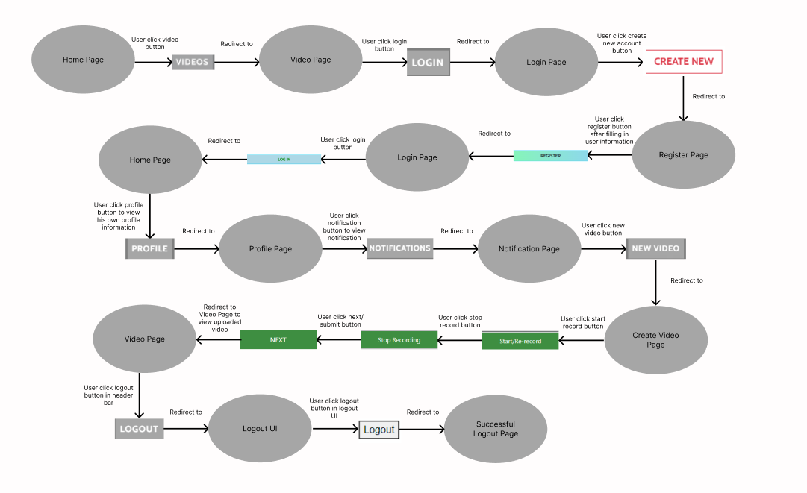
  - ER Diagram Screenshot

  - Design Video Screenshot

### Weekly Log / Team Weekly Log / Additional
- Worked on my own weekly log, contribute to team weeklog.
- Additional: Following images are the screenshot of the whole website testing:
  - Whole Website Test Screenshot

# Preferred name -> Ssc name -> Github name

- Adrian -> Adrian Fong -> AdrianFWM

## Term 2 Week 1 2023/12/04~2023/01/14

- Task I have worked on this week and winter break.
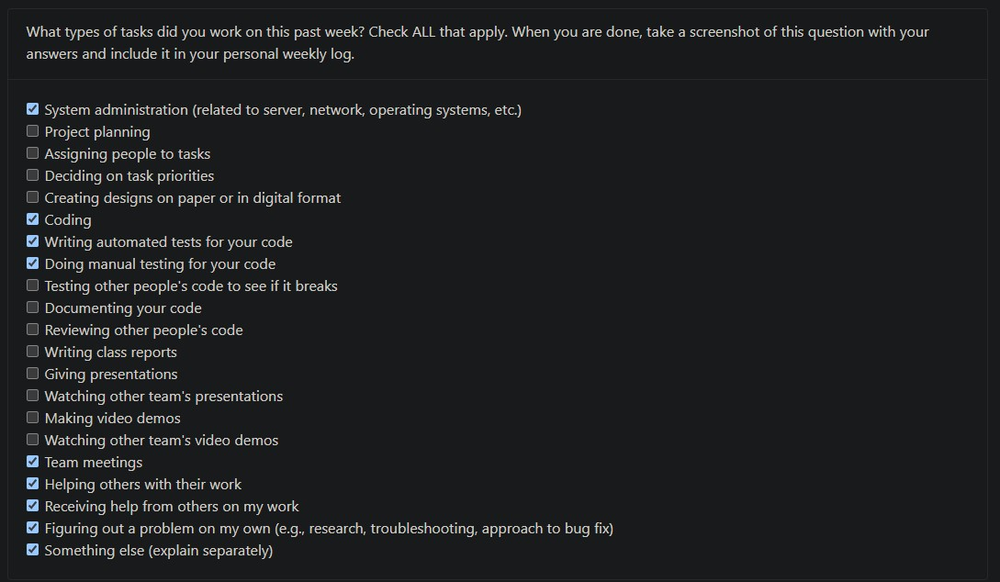

## Recap on your week's goals

### RDS Database
- Worked on "RDS Database setup" on project board, successfully made a connection from local SQLite to RDS PostgreSQL database, and made a new database on RDS with our current SQL database structure.
  - [AWS RDS Database branch](https://github.com/COSC-499-W2023/year-long-project-team-13/tree/aws-testing)
  - RDS database screenshot
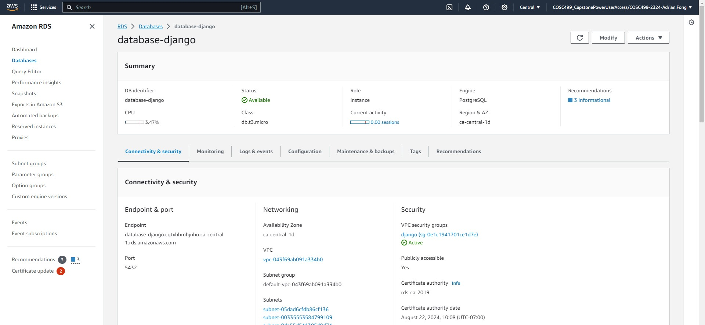

### EC2 / Elastic Beanstalk
- Worked on "AWS Cloud server setup" on project board, successfully made an Elastic Beanstalk web server with EC2 ip connection, and connect to RDS database. Our website is able to deploy and use it on AWS Elastic Beanstalk server.
  - [AWS EC2/Elastic Beanstalk branch](https://github.com/COSC-499-W2023/year-long-project-team-13/tree/aws-testing)
  - EC2 screenshot

  - Elastic Beanstalk screenshot
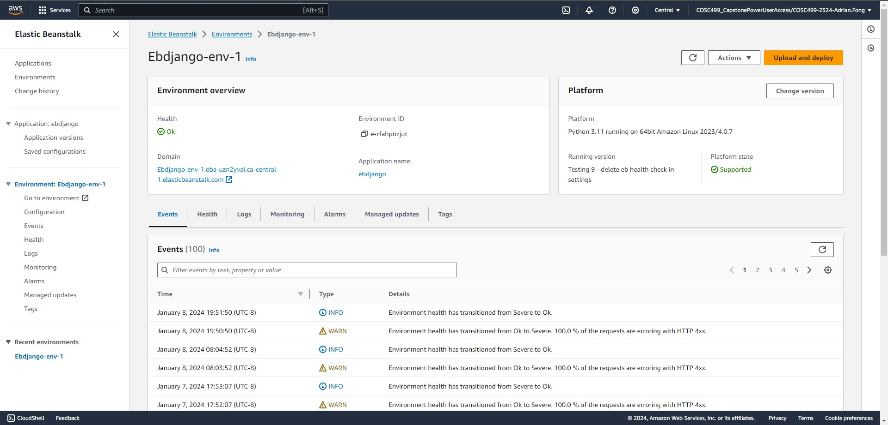
  - Elastic Beanstalk load with our webpage screenshot
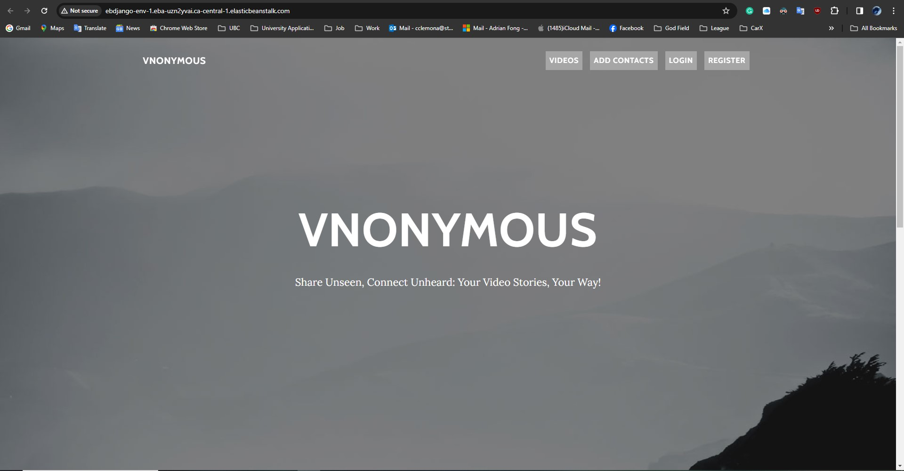

### Update Database Structure (In-Progress)
- Working on "Update Database structure" on project board, added "User Information" table and "Video Request" table on SQL database. Both table are connect to the "Users" table. New added tables display data on admin page.
  - [Update Database Structure branch](https://github.com/COSC-499-W2023/year-long-project-team-13/tree/update_database)
  - Admin page table screenshot

  - User information table content screenshot

  - Video request table content screenshot

  - Database structure we aim to update to

  - Our original database stucture

### Edit Profile (Birthdate) / Testing
- Worked on updating the profile page with users able to view and edit their birthdate. As we updated the database structure, and added birthdate into user's profile.
- Testing on Profile page successfully pass.
  - [Update Database Structure branch](https://github.com/COSC-499-W2023/year-long-project-team-13/tree/update_database)
  - Edit birthdate on profile page screenshot (Red Arrows: birthdate)

  - Edit profile (with birthdate) screenshot
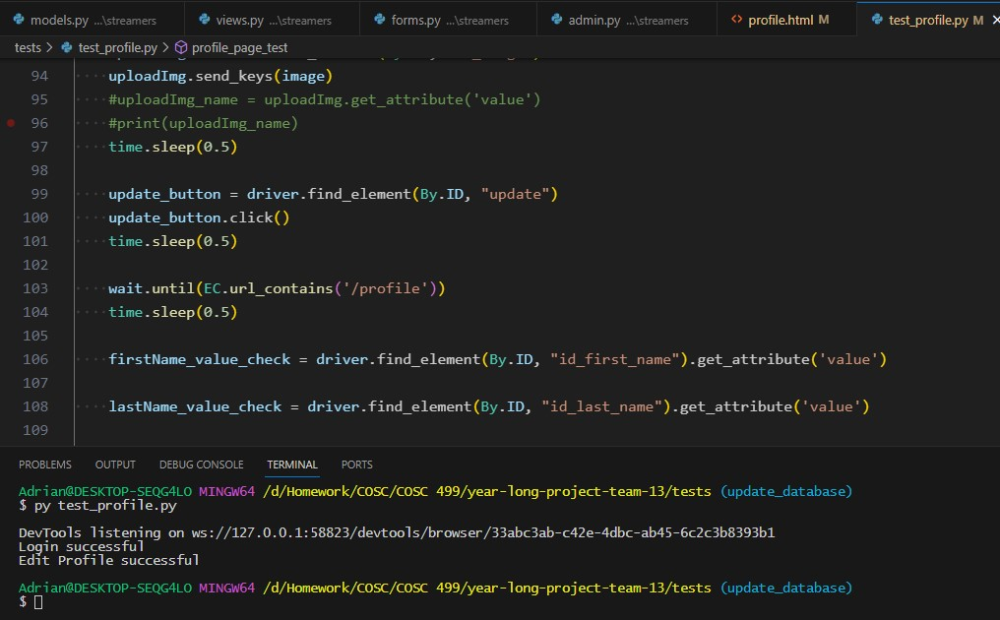

### Weekly Log / Team Weekly Log / Additional
- Worked on my own weekly log, contribute to team weeklog.
- I got some help from Ethan for setting up Elastic Beanstalk server with IAM user identity roles.
- Helped Raymond on changing password on setting page.
- I did encounter a lot of challenge on setting up RDS database and Elastic Beanstalk server on AWS with Django and Python which it does not have a proper setup guide from the internet. After few weeks of tries, I successfully setup database and server on AWS.
- Also, I encounter to update new tables on SQL database which the admin page was not showing or updating any new table or data. Now, it is showing both new tables with data on admin page which serval code fixes.
- We had meetings on Tuesday, Thursday and Saturday this week.

# Preferred name -> Ssc name -> Github name

- Adrian -> Adrian Fong -> AdrianFWM

## Term 2 Week 2 2023/01/15~2023/01/21

- Task I have worked on this week and winter break.

## Recap on your week's goals

### Rearrange Folders (Combine files/folders from Streamer to Stream)/ Tests
- Worked on "rearrange folders" on project board, every html/css/functions are combined from Streamer folder to Stream folder, all files works properly on Stream folder, so we do need to import and deal with conflict error across Streamer and Stream folder files.
- Fixed all tests to run properly after combining 2 folder files. All tests passes after fixes.
  - [Rearrange Folder Pull Request/Commit](https://github.com/COSC-499-W2023/year-long-project-team-13/pull/116)
  - Rearrange Folder Before screenshot (have Streamer folder)
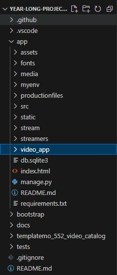
  - Rearrange Folder After screenshot (without Streamer folder)
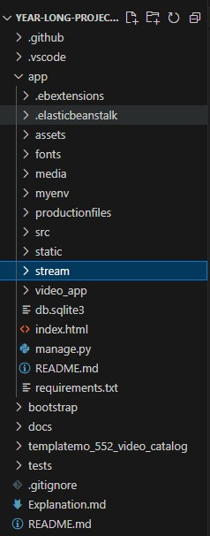
  - Rearrange Folder Test screenshot
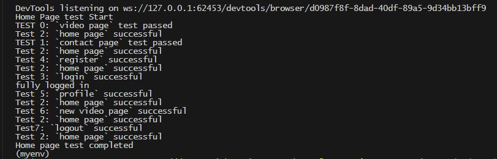

### Update Database Structure (In-Progress)
- Working on "Update Database structure" on project board, after rearranging folders from streamer to stream, I deleted "Profiles" and "User Infos" table from Streamers and moved them to Stream. Also, added "Settings" table and "Notifications" table on SQL database. Notification page are able to display user login notifications from database. For "Setting" table, users can save their prefer settings
- Only 2 more tables needed to be update which are "Posts" and "Contacts" tables, I will finish both table next week.
  - [Update Database Structure Pull Request/Commit](https://github.com/COSC-499-W2023/year-long-project-team-13/pull/116)
  - [Update Database Structure branch](https://github.com/COSC-499-W2023/year-long-project-team-13/tree/update_database)
  - Update Database Structure screenshot
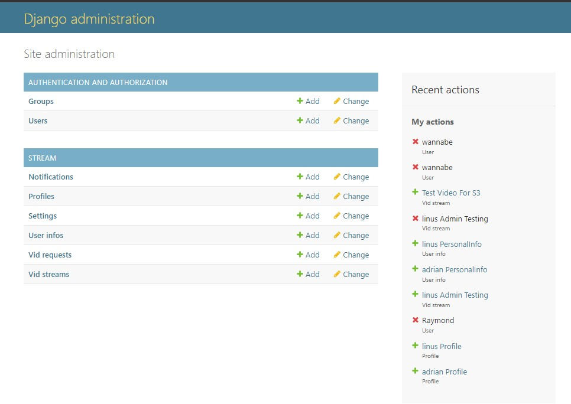
  - Settings Table screenshot
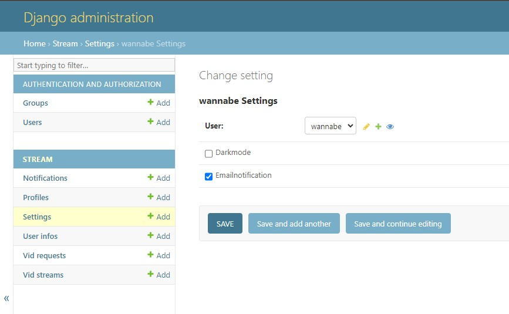
  - Notification Page screenshot (with login notifications)

  - Database structure we aim to update to

### RDS Database / EC2 / Elastic Beanstalk
- Upload RDS database connection to our local device, so we all can use the RDS database (and have the same database data) and not to have local SQL database error(Everyone with different database data).
- Update EC2/Elastic Beanstalk server with our newest version of our website after database update and folder rearrangement. The server runs the newest website properly.
  - [Update RDS Database / EC2 / Elastic Beanstalk Pull Request/Commit](https://github.com/COSC-499-W2023/year-long-project-team-13/pull/119)
  - Update RDS Database / EC2 / Elastic Beanstalk screenshot (Red arrow update time and version)
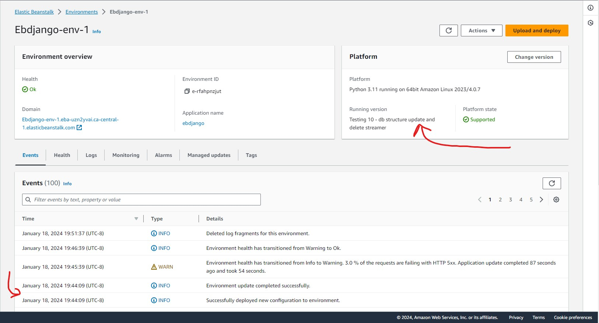

### Change Password Function (Setting Page) (In-Progress)
- Worked on change password function for Setting Page, it successfully updates user's password to the database with encryption.
- However, Raymond still need to work on confirming password function before changing password.
- Helped Raymond on Setting Page and wrote change password form(front-end) and function(back-end) during team-meeting.
  - [Setting branch](https://github.com/COSC-499-W2023/year-long-project-team-13/tree/setting)
  - Change Password Function screenshot

### Weekly Log / Team Weekly Log / Additional
- Worked on my own weekly log, contribute to team weeklog.

# Preferred name -> Ssc name -> Github name

- Adrian -> Adrian Fong -> AdrianFWM

## Term 2 Week 3 2023/01/22~2023/01/28

- Task I have worked on this week and winter break.
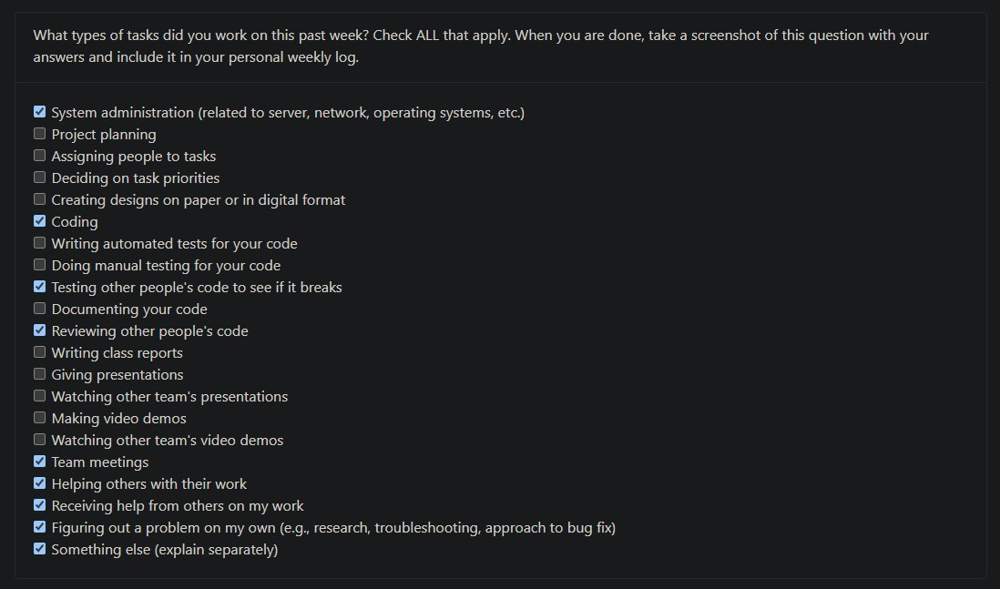

## Recap on your week's goals

### Update Database Structure (Post, Contact, Friend Request table) [Complete]
- Worked on "Update Database structure" on project board, finished updating to the new database with "Post", "Friend Request", and "Contact" tables. "Post" table allow users to make post of their uploaded videos, "Friend Request" table allow users to send friend request to each other. After users confirmed the friend request, "Contact" table will store both users' usernames and make them as friends.
- Make a new dbsqlite3 database with new data, so it won't create conflict between old data and new data within the database.
  - [Update Database Structure (Post, Contact, Friend Request table) Pull Request/Commit](https://github.com/COSC-499-W2023/year-long-project-team-13/pull/124)
  - New Database screenshot
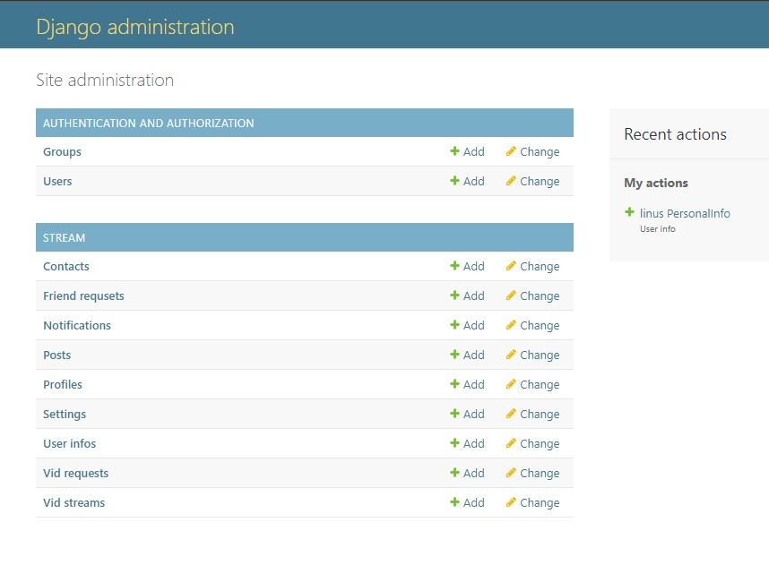
  - Post table screenshot
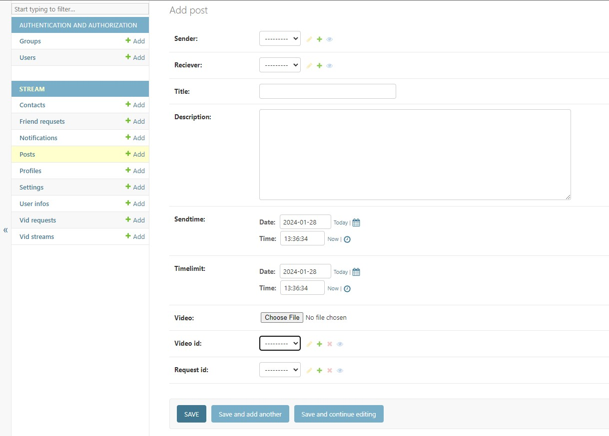
  - Friend Request table screenshot
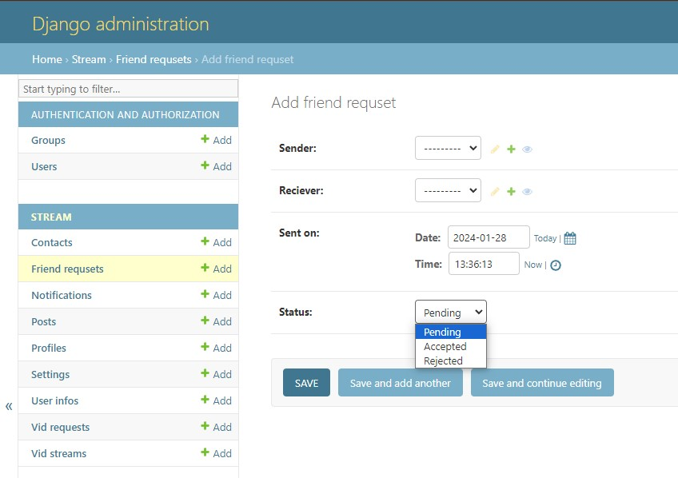
  - Contact table screenshot
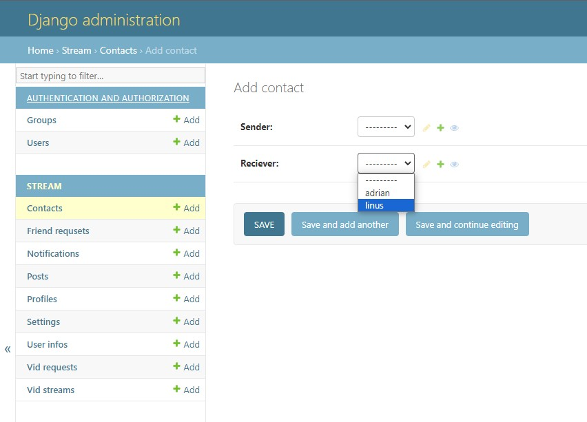

### Change Password/Confirm Password function (Worked with Raymond)
- Worked on "Settings - Change Password", we finished up the change password functions that will check if the new password follows our password requirement lists (cannot be contact username/email information, cannot be commonly used password, must be longer than 8 characters, must be a mixed of letters and numbers), and confirm password to make sure both password are the same before submitting it into the database.
  - [Change Password/Confirm Password function Pull Request/Commit](https://github.com/COSC-499-W2023/year-long-project-team-13/pull/126)
  - Change Password/Confirm Password screenshot
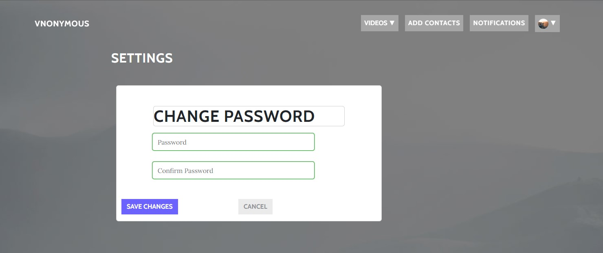

### Friend Request function/Notification (In-Progress)
- Working on "Add Contact function", "Friend Request UI (Contact Page)", and "Notification for friend request", I wrote functions to allow users to send friend requests to each other (Contact Page), and friend request notification will appear after friend request has been sent.
- Once the friend request has been sent to a user, users cannot send another request to the same user.
- If both users are friend in the "Contact" table in the database, they cannot send a friend request to each other.
- It is still missing a test for it, and it will be finish before the peer testing.
  - [Friend Request/Add Contact Branch](https://github.com/COSC-499-W2023/year-long-project-team-13/tree/add_contact)
  - Friend Request UI (Contact Page) screenshot
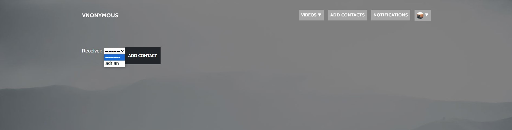
  - Usernames in User table (Red other users, Green account logged in) screenshot
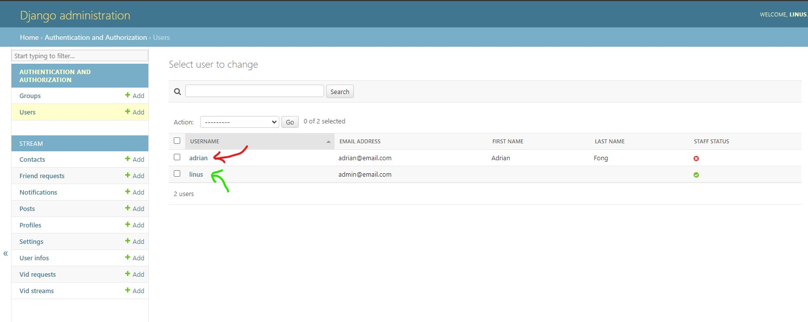
  - Friend Request Notification (After request sent) screenshot
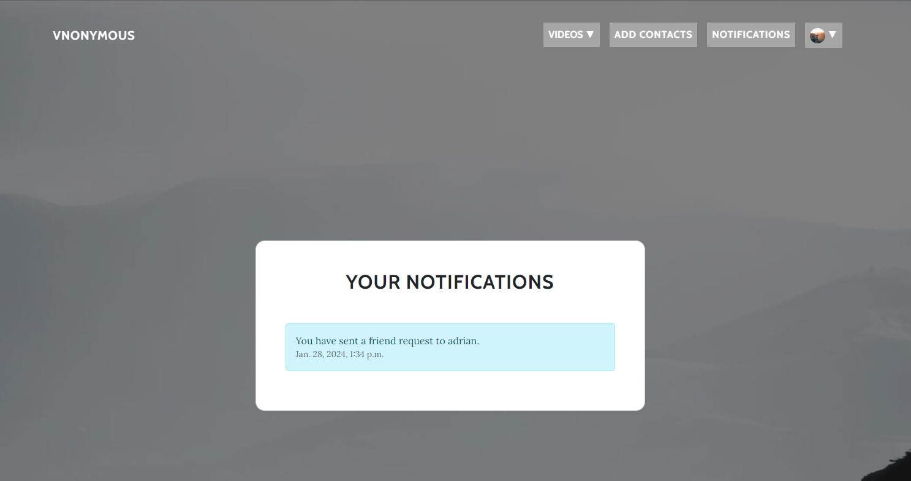

### Review other team member's pull request
- Reviewed Beth's "Testing" and "Topbar" pull request, and tested all tests and passed.
  - [Testing Pull Request/Commit](https://github.com/COSC-499-W2023/year-long-project-team-13/pull/120)
  - [Topbar Pull Request/Commit](https://github.com/COSC-499-W2023/year-long-project-team-13/pull/125)

### Weekly Log / Team Weekly Log / Additional
- Worked on my own weekly log, contribute to team weeklog.

# Preferred name -> Ssc name -> Github name

- Adrian -> Adrian Fong -> AdrianFWM

## Term 2 Week 4 2023/01/29~2023/02/04

- Task I have worked on this week and winter break.
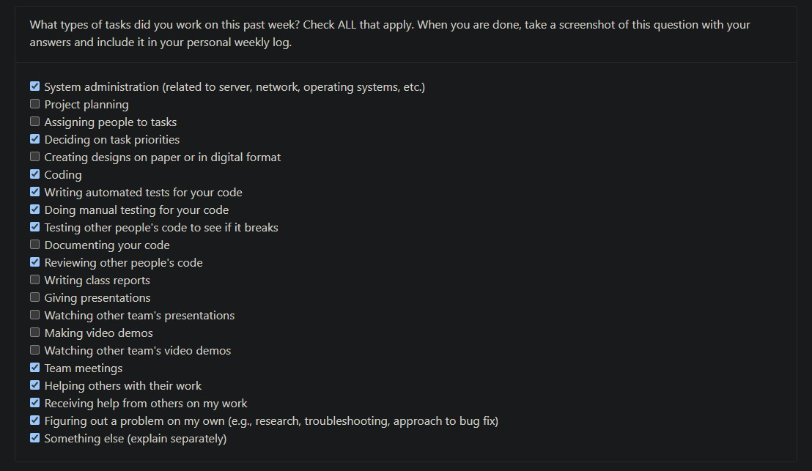

## Recap on your week's goals

### Task priorities (Received feedback from peer testing)
- We received feedbacks from peer testing, so we decide which feedback should we start this week.
- Therefore, I decide to continue working on add contact page (send friend request/search bar) with Herman, working on update database (feedbacks), working on notification page (accept/reject friend request), working on edit profile page (change password button to setting page).
  - Feedback List screenshot

  - Feedback List screenshot
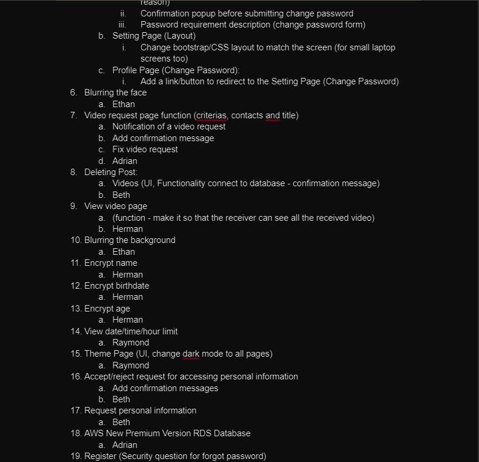

### Update Database Structure (Notification table, Permission) [Complete]
- Worked on "Update Database structure" on project board, finished updating Userinfo table with "Permission" to clarify user is an "Admin", "Doctor" or "Patient", and the website layout will be slightly different for each permission type. Also, updated the notification table with type which identify which type of notification is stored,
id connect to "friend request", "video request", "post", and "video" table.
- Next week, I will be working on accept/reject function on Notification page with new notification database structure.

  - [Update Database Structure (permission [Userinfo table], type, foreign id [notification table]) Pull Request/Commit](https://github.com/COSC-499-W2023/year-long-project-team-13/pull/135)
  - Permission (Userinfo table) screenshot
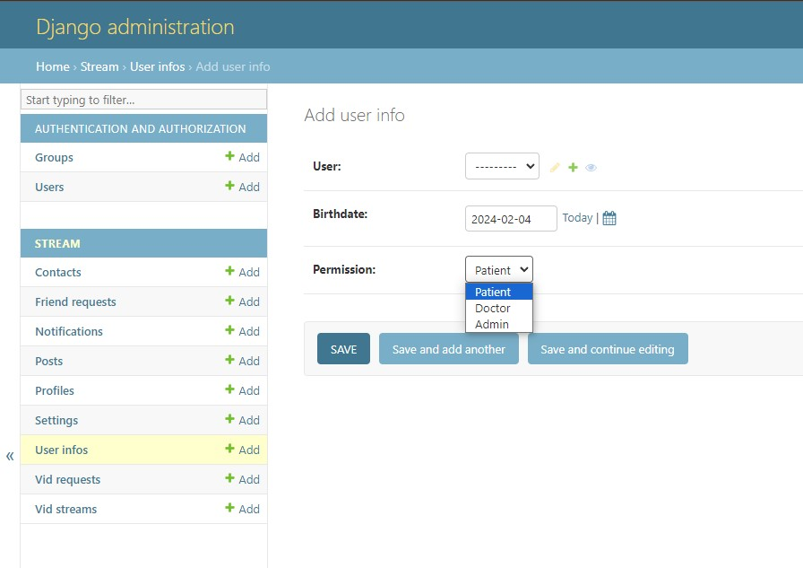
  - Notification table screenshot
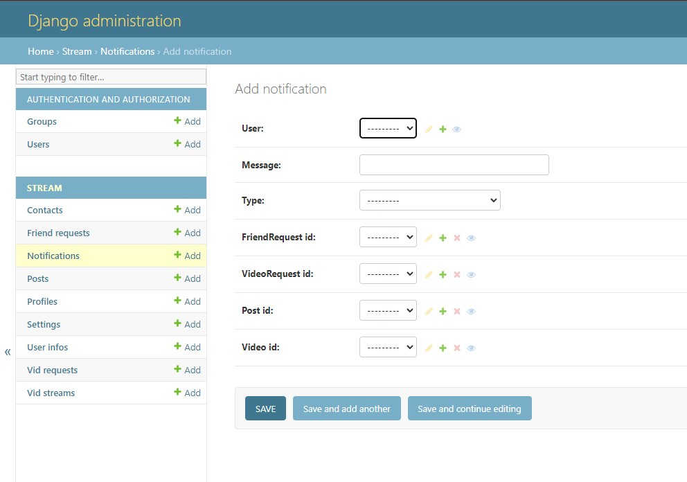

### Send Friend Request (Add contact page) [Complete]
- Worked on "Add Contact Function", "Notification for friend request", "Friend Request UI" on project board, I created a friend request page with a drop down bar to let users to choose friends that they want to add, and send a friend request. After friend request has been sent, both receiver and sender of the friend request will have a friend request notification.
- I wrote tests for friend request/notification. All testing was done before the peer testing, all testing passed.
- After peer testing, we received some UI feedback for add contact page, so herman added a search bar to let users to search for usernames.
- I fixed some testing issue and filter issue for search bar.
- All tests pass now.

  - [Add contact page (Send friend request), access new database Pull Request/Commit - Before Peer Testing](https://github.com/COSC-499-W2023/year-long-project-team-13/pull/127)
  - [Add contact page (Search Bar) Pull Request/Commit - Before Peer Testing](https://github.com/COSC-499-W2023/year-long-project-team-13/pull/134)
  - Friend Request UI - before peer testing screenshot

  - New friend request UI - fixed with peer testing feedback layout screenshot
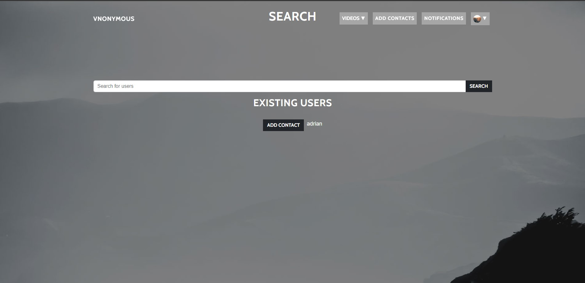

### Change Password Button (Profile page) [In-Progress]
- Working on "Change Password Button (Profile Page)" on project board, make a button to redirect to change password form on setting page. The button can go to setting page now, but still need to fix some css/bootstrap code (little out of place).

  - [Edit Profile Branch](https://github.com/COSC-499-W2023/year-long-project-team-13/tree/editprofile)
  - Change Password Button screenshot
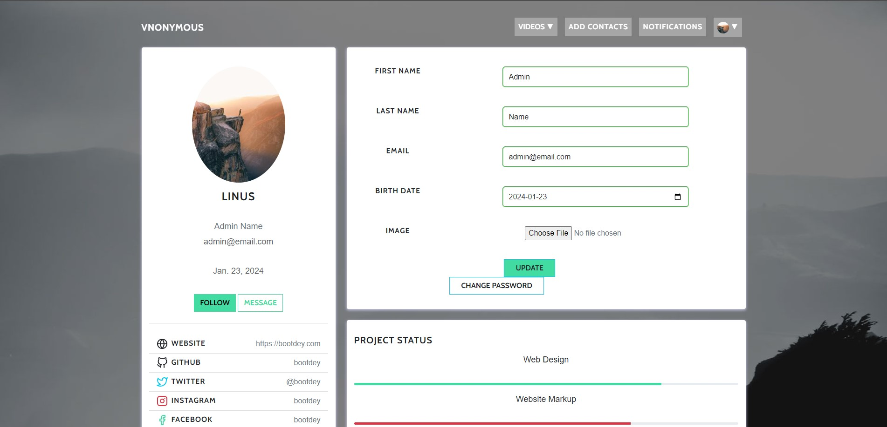

### Review other team member's pull request
- Reviewed Beth's "Create video" pull request, reviewed Herman's code for search bar on add contact page, and tested all tests and passed.
  - [Create video Pull Request/Commit](https://github.com/COSC-499-W2023/year-long-project-team-13/pull/132)
  - [Add contact Pull Request/Commit](https://github.com/COSC-499-W2023/year-long-project-team-13/pull/134)

### Weekly Log / Team Weekly Log / Additional
- Worked on my own weekly log, contribute to team weeklog.
- Added some code to fix add contact search bar function, and worked on add contact tests fix.
- Fixed on some confirm password UI problem.

# Preferred name -> Ssc name -> Github name

- Adrian -> Adrian Fong -> AdrianFWM

## Term 2 Week 5 2023/02/05~2023/02/11

- Task I have worked on this week and winter break.
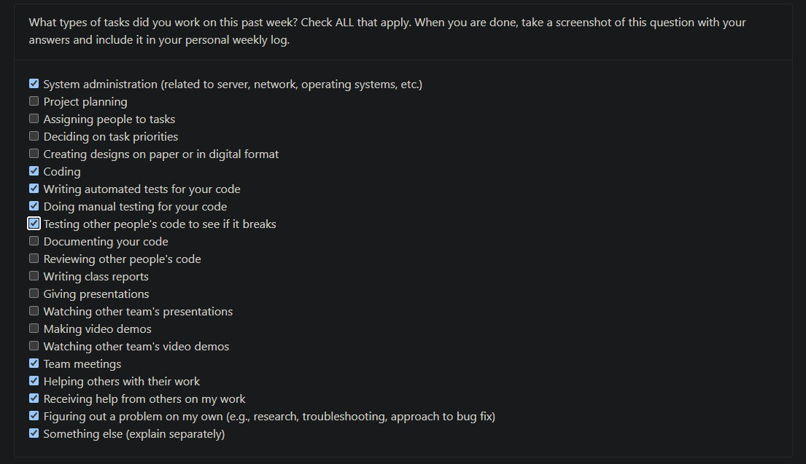

## Recap on your week's goals

### Change Password Button CSS/Testing (Profile Page) [Complete]
- Worked on "Change Password Button (Profile Page)" and "Change Password Button (profile page) test" on project board, finished up the css for the change password button, and also wrote test for the change password button.

  - [Editprofile (Change Password Button) Pull Request/Commit](https://github.com/COSC-499-W2023/year-long-project-team-13/pull/137)
  - Change Password Button new CSS layout screenshot
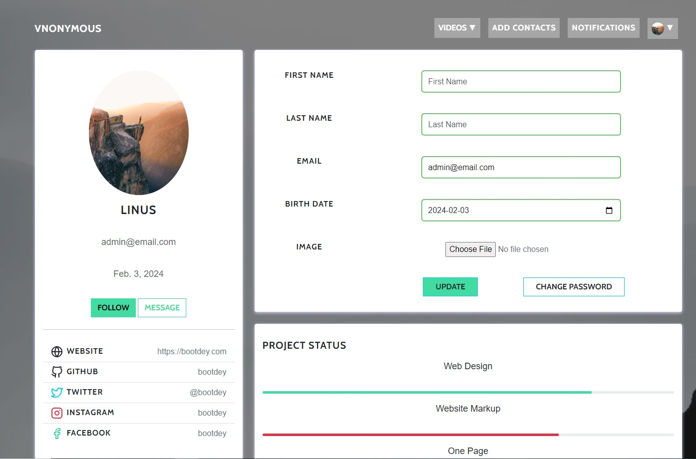
  - Redirect to Setting Page screenshot
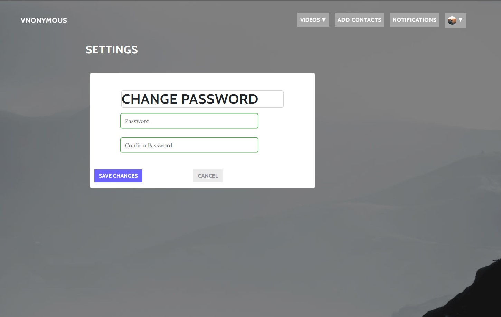
  - Change Password Button Testing screenshot
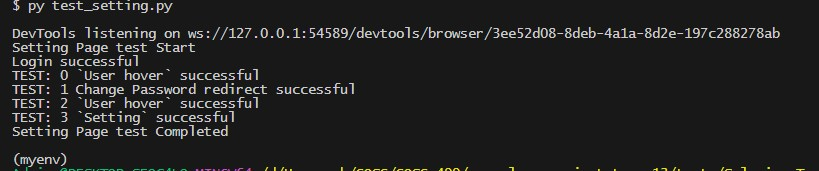

### Remove Friend Request (Notification page) [Sender side]
- Worked on "Remove Friend Request - UI" and "Remove Friend Request - Function" on project board, users of the friend request sender are able to remove friend request on the notificaiton page after friend request sent to receiver. After the sender remove friend request, the friend request notification and friend request will be removed from the database and have a new "successful remove" message on notificaiton page, and sender can resend another new friend request to receiver. On receiver side, if the friend request is removed, then their notification of friend request will also be removed from database as well.
- All the functions and css layout are finished, just need to finish up testings next week.

  - [Notifications (remove friend request) Pull Request/Commit](https://github.com/COSC-499-W2023/year-long-project-team-13/pull/144)
  - Remove friend request layout (Notification page) screenshot
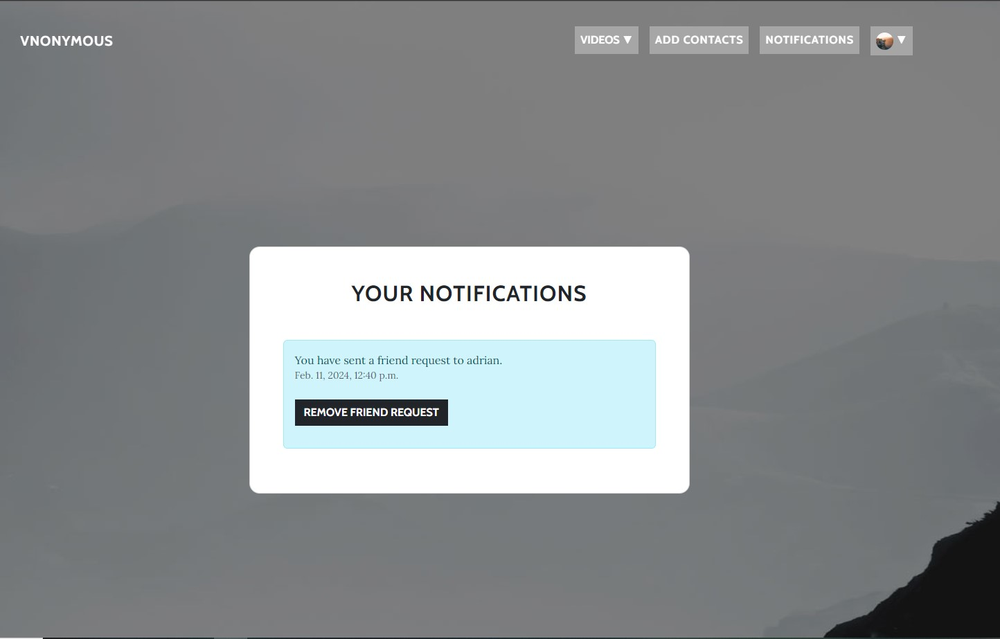
  - After remove friend request has been clicked (Notification page) screenshot
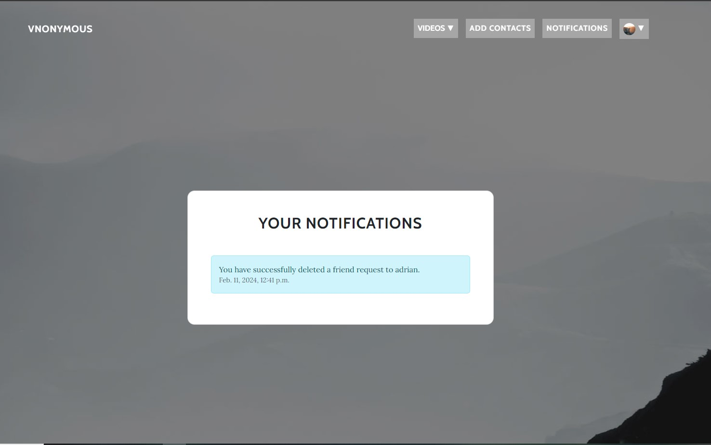
  - Friend request reappeared (Add contact page) screenshot
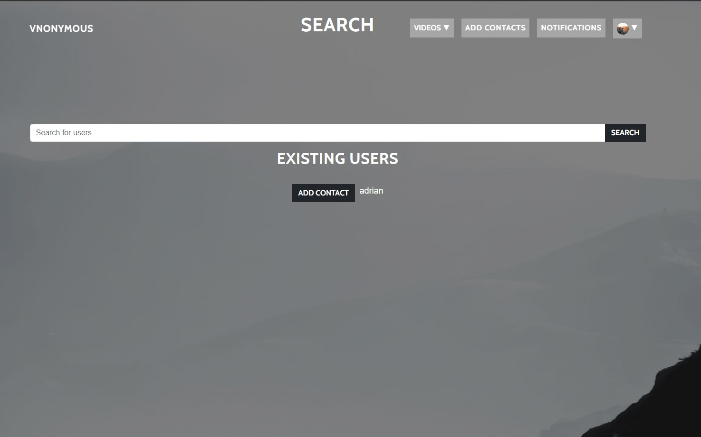
  - Another friend requets (Notification page) screenshot
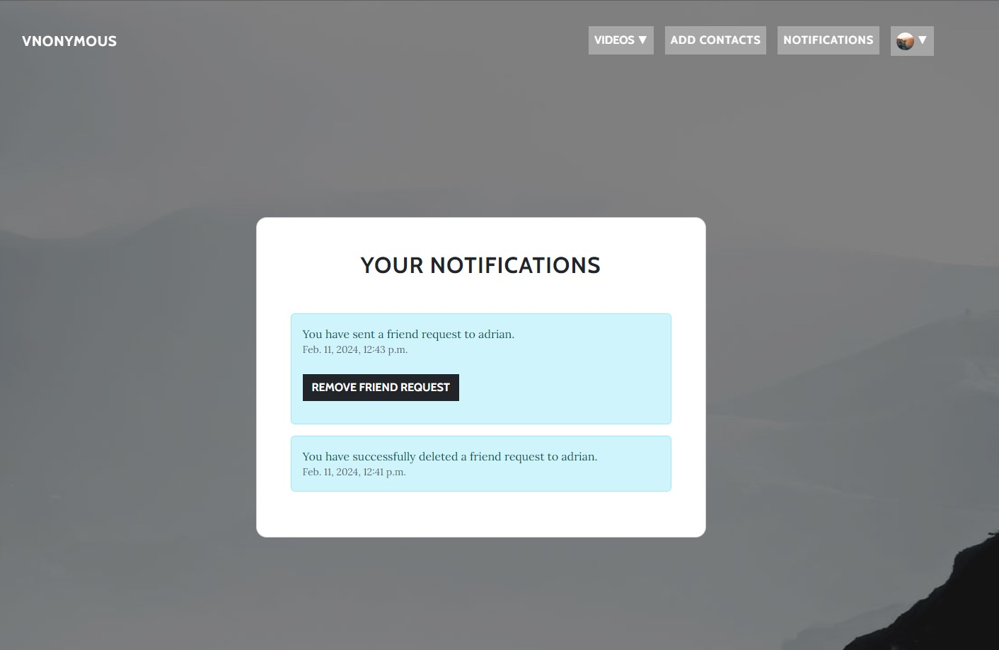

### Accept/Reject Friend Request (Notification page) [Receiver side]
- Worked on "Accept/Reject Friend Request - UI" and "Accept/Reject Friend Request - Function" on project board, users of the friend request receiver are able to accept or reject friend request on the notificaiton page after friend request sent from sender. After the friend request has been accepted, the friend request and friend request notification will be removed from the database, and add both sender and receiver into Contact table (friend list) in database; also, create a "successfully become friends" message on notificaiton page. If friend request has been rejected by the receiver, the friend request and friend request notification will be removed from the database, and create a "reject friend request" message on notification page.
- All the functions and css layout are finished, just need to finish up testings next week.

  - [Notifications (accept/reject friend request) Pull Request/Commit](https://github.com/COSC-499-W2023/year-long-project-team-13/pull/144)
  - Accept/Reject friend request layout (Notification page) screenshot
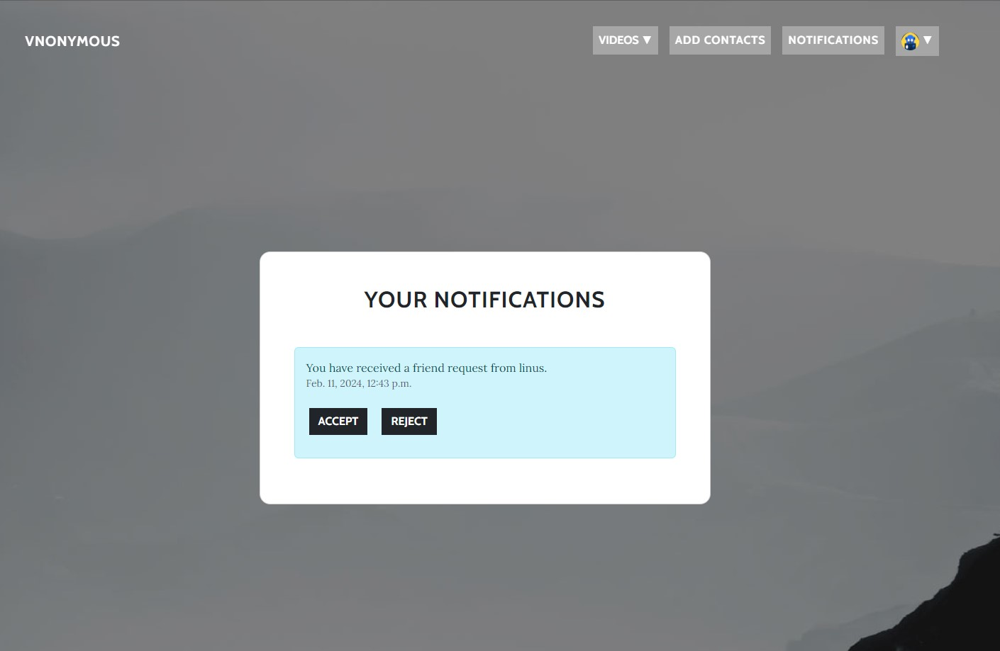
  - After reject friend request has been clicked (Notification page) screenshot
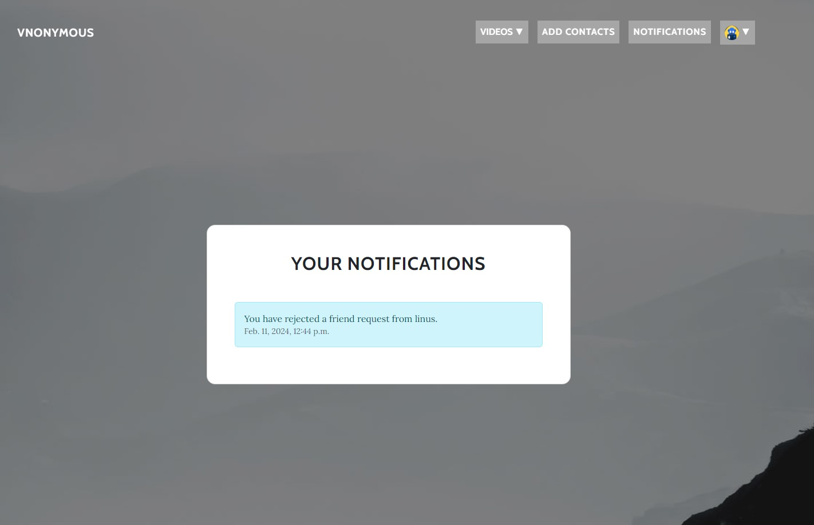
  - After accept friend request has been clicked (Notification page) screenshot
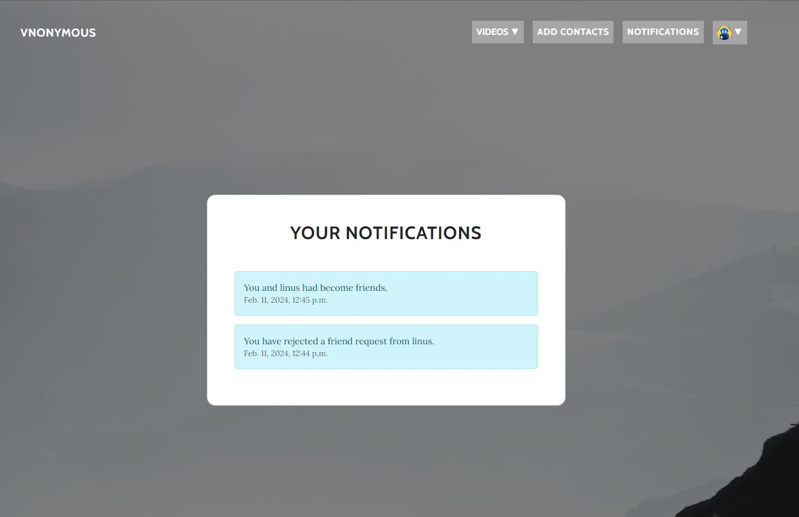
  - Contact table (friend list) new data (sender/receiver) screenshot
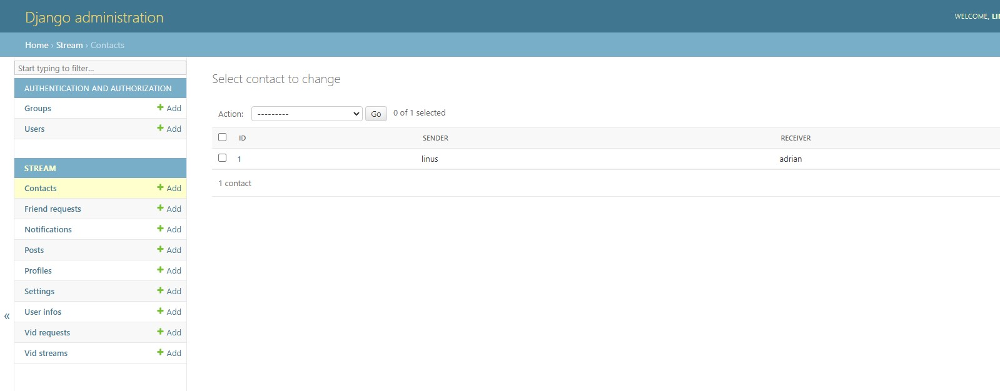

### Admin model display adjustment to all tables
- Worked on "Admin table adjustment" on project board, admin table are able to display all data with details (all columns) without clicking into the data id which makes admin users easier to read data.

  - [Admin Display Adjustment Pull Request/Commit](https://github.com/COSC-499-W2023/year-long-project-team-13/pull/144)
  - Database layout (Notification table) screenshot
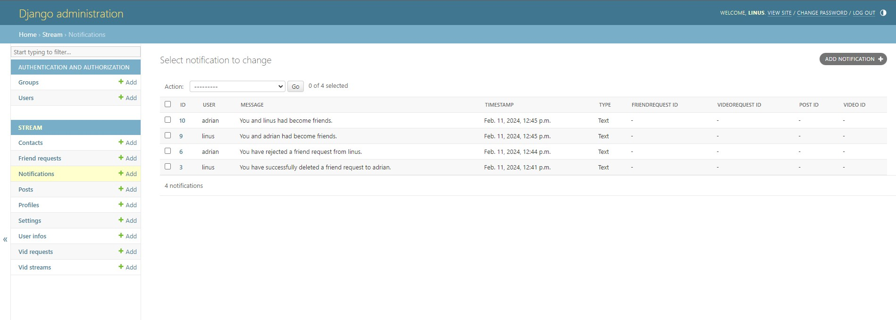
  - Database layout (Userinfo table) screenshot
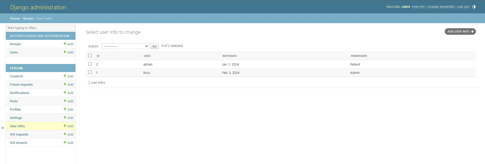
  - Database layout (Contact table) screenshot

### Weekly Log / Team Weekly Log / Additional
- Worked on my own weekly log, contribute to team weeklog.
- Manually testing on Raymond's change password/confirm password form and css UI layout (Setting page)

# Preferred name -> Ssc name -> Github name

- Adrian -> Adrian Fong -> AdrianFWM

## Term 2 Week 6 2023/02/12~2023/02/18

- Task I have worked on this week and winter break.
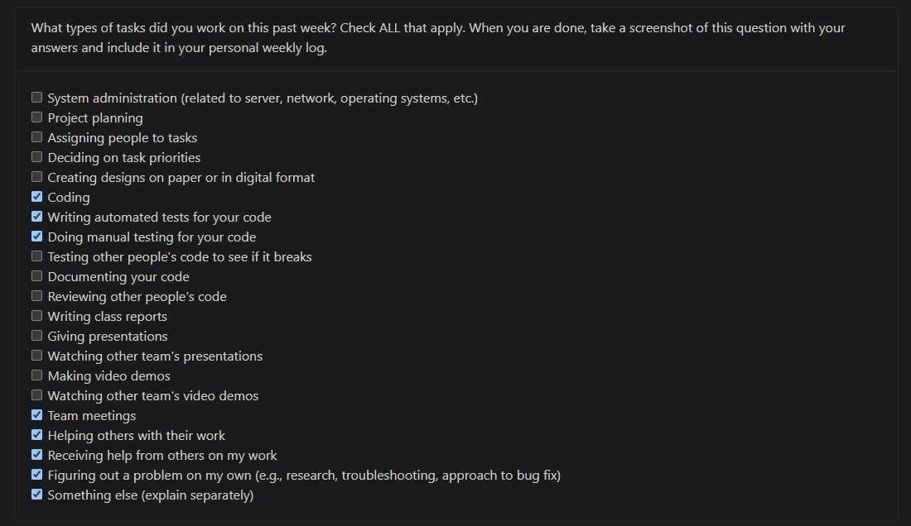

## Recap on your week's goals

### Remove/Accept/Reject Friend Request Selenium/pytest [Complete]
- Worked on "Accept/Reject Friend Request - Test" and "Remove Friend Request - Test" on project board, finished Selenium test and pytest for remove/accept/reject friend request, and send/receiver friendlist function (contact table).
- Added all the test to master test.
- All Selenium test and pytest passes with no issue/error.
- All functions on Add Contact page, Notification, Admin page new functions are merged to master branch.

  - [Notifications (remove/accept/reject friend request), pytest, Selenium test, Admin page reorganized Pull Request/Commit](https://github.com/COSC-499-W2023/year-long-project-team-13/pull/144)
  - Add contact/Friend request Selenium test screenshot
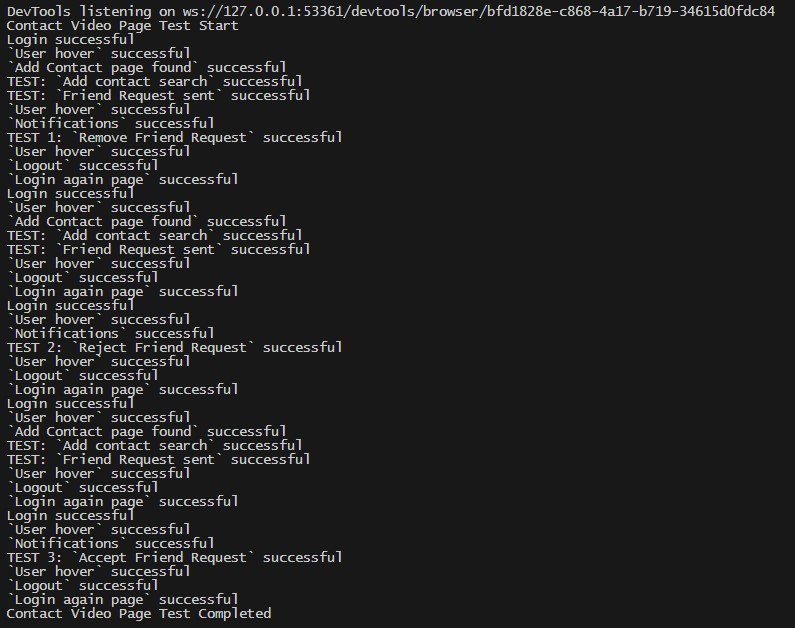
  - Master Selenium test screenshot (with add contact test included)
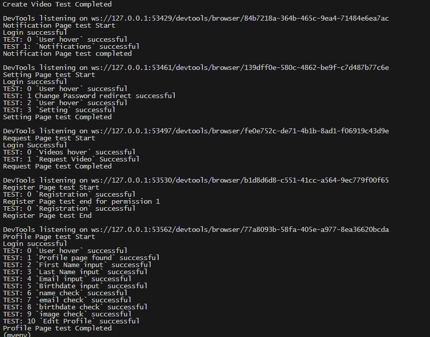
  - Add contact/Friend request pytest screenshot
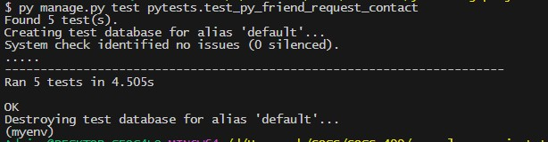

### Weekly Log / Team Weekly Log / Additional
- Worked on my own weekly log, contribute to team weeklog.

# Preferred name -> Ssc name -> Github name

- Adrian -> Adrian Fong -> AdrianFWM

## Term 2 Week 7/8 2023/02/19~2023/03/03

- Task I have worked on this week and winter break.
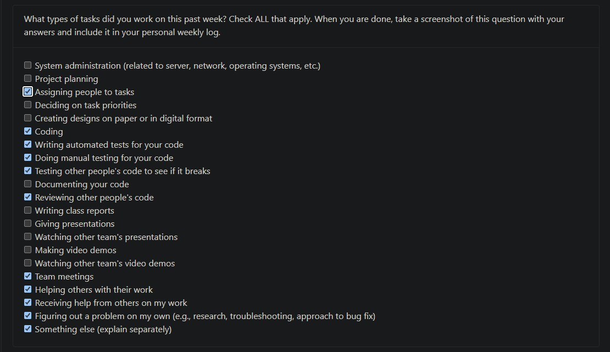

## Recap on your week's goals

### Send/Remove Video Request function and Selenium/pytest, Notification messages [Complete]
- Worked on "Request Video Function", "Request Video UI", "Notification of video requests (Display/ Remove video request function)" and "Video Request Selenium test/pytest" on project board, finished receiver permission account can access video request page and send video request to users in their friend list with sender permission. Video request form can choose receiver of video request name from friend list(sender permission), description message and a due date.
- After request has been sent, notification message will appear. Sender of video request can remove video request. And it will show "successfully remove video request" message.
- On the receiver of video request side, they can see message of "received a video request".
- Finished Selenium test and pytest for send/remove video request.
- Added all the test to master test.
- All Selenium test and pytest passes with no issue/error.
- All functions on Video request page and Notification are merged to master branch.

  - [Video request page & functions & selenium/pytest Pull Request/Commit](https://github.com/COSC-499-W2023/year-long-project-team-13/pull/149)
  - Video Request form screenshot (Receiver permission)
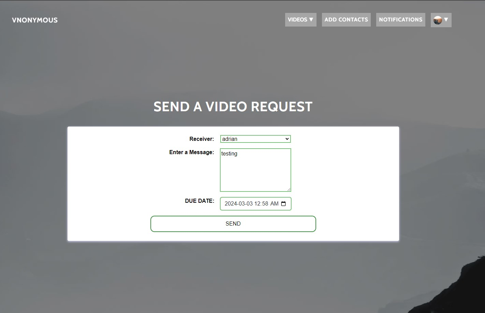
  - Video Request notification screenshot (Receiver permission) [with request ID]
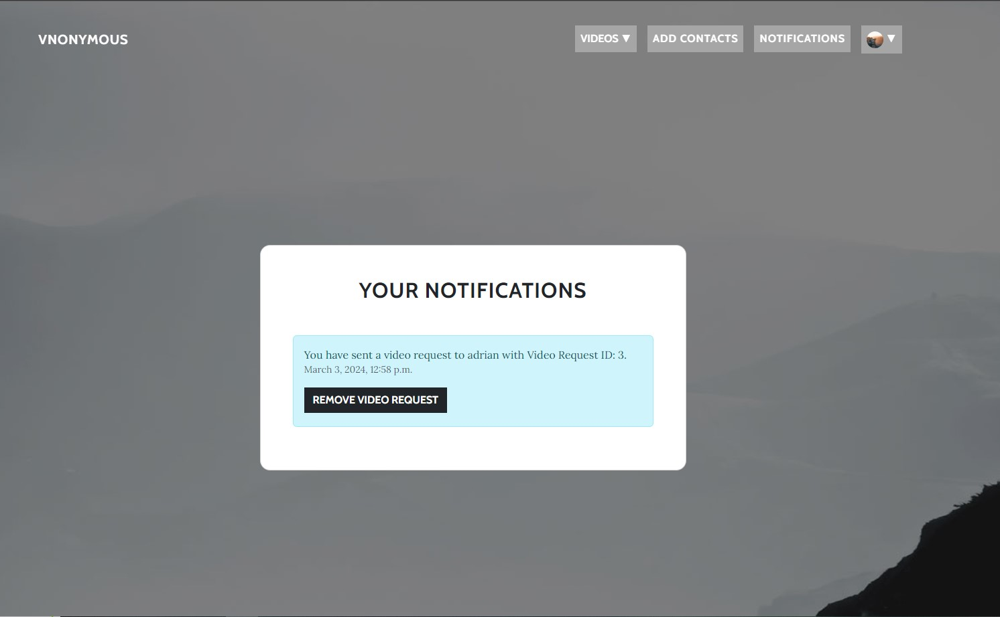
  - Remove Video Request screenshot (Receiver permission)
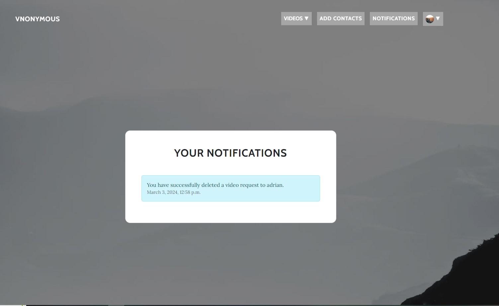
  - Video Request notification screenshot (Sender permission) [with request ID]
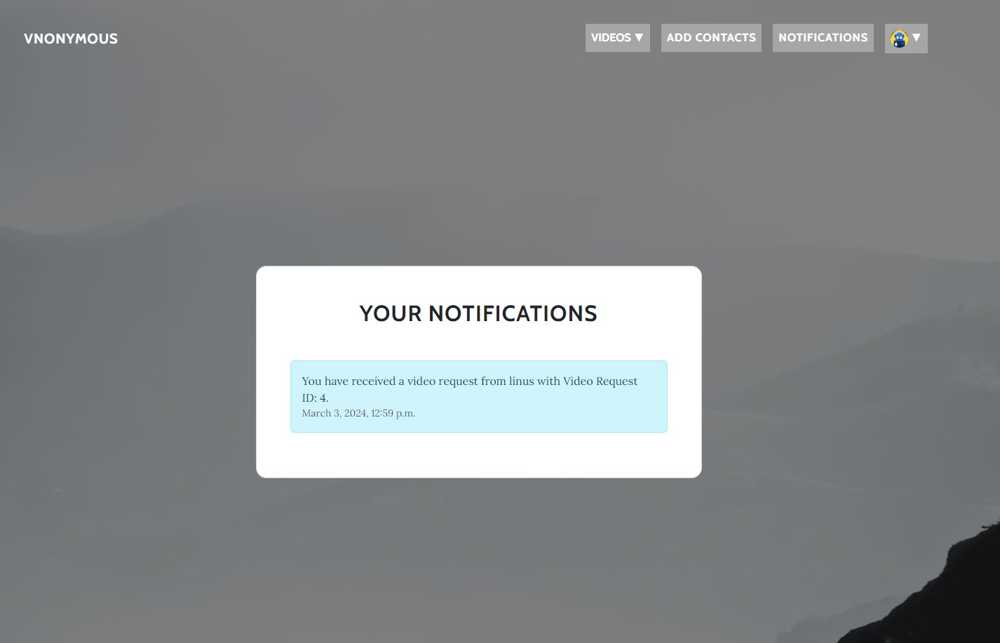

### Upload Video Post function and notification
- Worked on "Upload Video Function" on project board, finished upload video function which sender permission account can send a video post with selected video request ID, title, description, time limit date and video file.
- After the video is uploaded, sender of video post and receiver of video post will both receive notification message.
- The video will display on view video.
- Still need to fix CSS layout of form.
- Need to write selenium test and pytest for it.

  - [Upload Video Post Branch](https://github.com/COSC-499-W2023/year-long-project-team-13/tree/post_video)
  - Video Upload Post form screenshot (Sender permission)
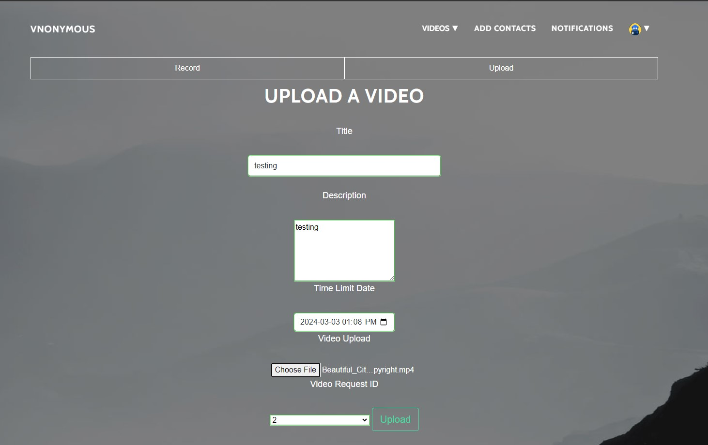
  - Video Upload Post notification screenshot (Sender permission)
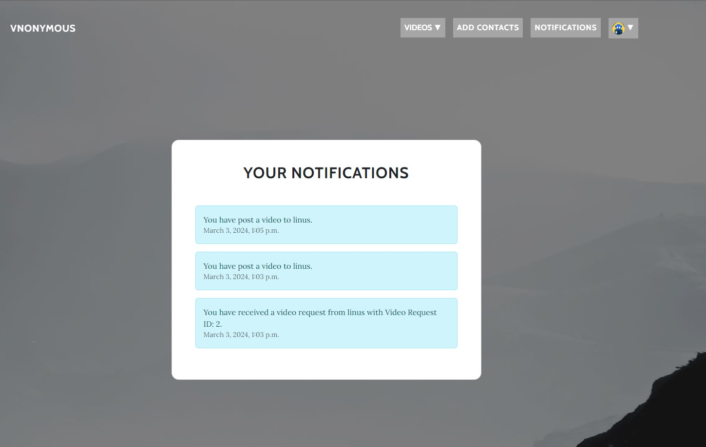
  - View Uploaded Video Post  screenshot
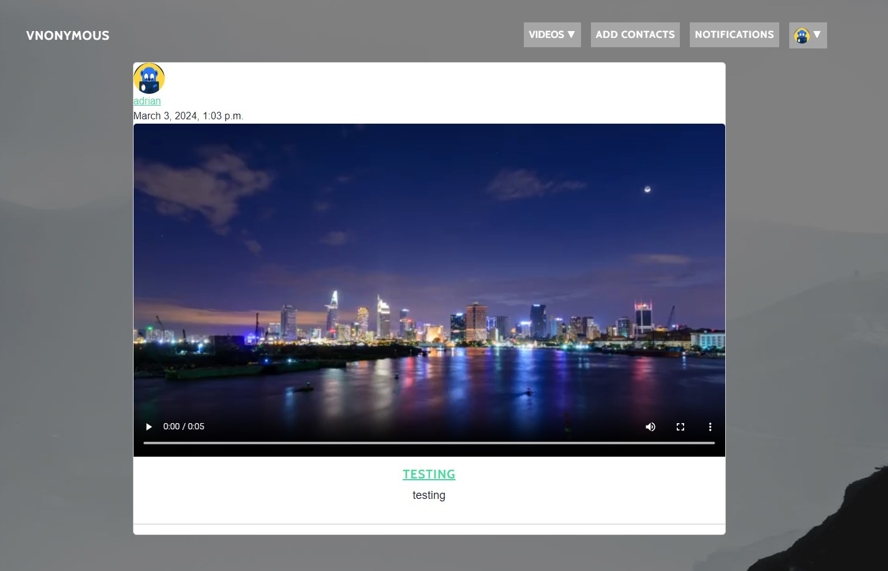

### View Video/Confirm Delete/Video List/Video Detail Function and UI [Complete]
- Worked on "View video - Function" on project board, finished view video post for sender or receiver of video post can view video.
- Also, sender of video post can delete the video on video detail page.
- Sender or receiver of video posts can see list of video from sender's account.
- Finished UI for view video, video detail, video list, confirm delete video.

  - [View Video Branch](https://github.com/COSC-499-W2023/year-long-project-team-13/tree/post_video)
  - View Video screenshot (Sender/Receiver of Post)

  - Video Detail screenshot (Sender of Post with update/delete button)

  - Confirm Delete Video Post screenshot [Sender of Post]
![Confirm Delete Video Post screenshot [Sender of Post]](./images/Adrian_images/T2_Week_7/confirm_delete.jpg)
  - Video Post List from sender user screenshot [Sender/Receiver of Post]
![Video Post List from sender user screenshot [Sender/Receiver of Post]](./images/Adrian_images/T2_Week_7/video_list.jpg)

### Create/Record Video Post function and notification [In-Progress]
- Working on "Create/Record Video Function" on project board, finished the form for create/record video page, but still need to find a way to upload recorded video into database.
- The page can record using webcamera, users can download the video or preview the video.
- Need to fix css layout of the form.
- Need Selenium/pytest.

  - [Create/Record Video Post Branch](https://github.com/COSC-499-W2023/year-long-project-team-13/tree/post_video)
  - Record Video using webcamera screenshot (Sender permission)
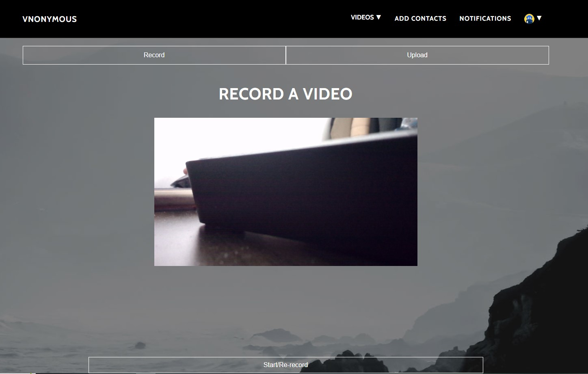
  - Video create/record Post form screenshot (Sender permission)
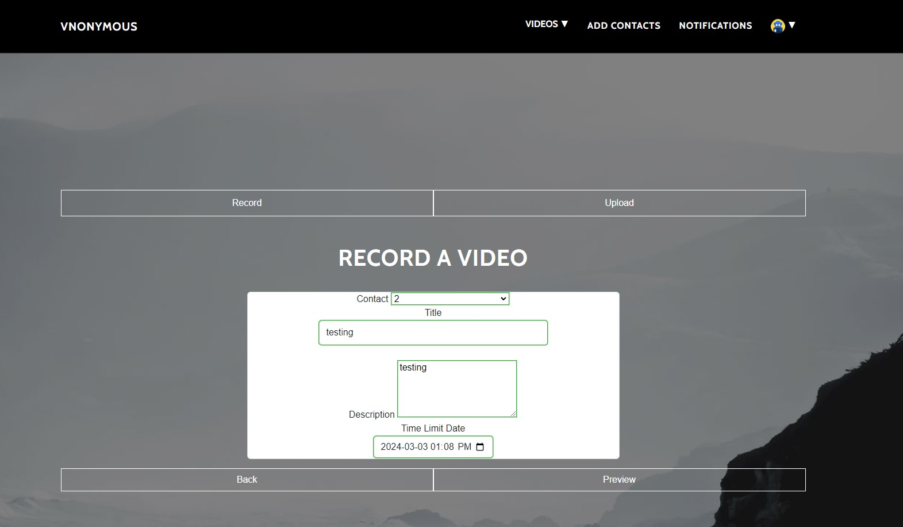

### Review other team member's pull request
- Reviewed Herman's and Raymond's "Setting branch" pull request, reviewed Ethan's and Beth's "create video branch" and "post video preview" pull requests, and tested all tests and passed.
  - [Setting branch changes Pull Request/Commit](https://github.com/COSC-499-W2023/year-long-project-team-13/pull/147)
  - [Merge the create video branch to master Request/Commit](https://github.com/COSC-499-W2023/year-long-project-team-13/pull/148)
  - [post video preview (not supposed to be here) Request/Commit](https://github.com/COSC-499-W2023/year-long-project-team-13/pull/152)

### Weekly Log / Team Weekly Log / Additional
- Worked on my own weekly log, contribute to team weeklog.
- Assign Task to Herman to work on register/setting/login page error colour to red from this week.
