# Weekly Personal Log

### Week 4 Sept 25 - Oct 1

This week we all worked together to work on the Project plan.

### Week 5 Oct 2 - Oct 8

This week was spent learning Django and becoming familiar with Python. I followed along with some online tutorials. This was for the learning django basics and set up. The following images are from the completion of the online tutorials.

### Week 6 Oct 9 - Oct 15

The setup and testing of the "Setting up the project Django base" on my computer. I also started working on the home page. I tried connecting the newly found html and css files to the basic set up of Django. The Setting up the project Django base is complete. The Home page is still in progress. I also started reading through a W3 school AWS tutorial to begin to be comfortable with AWS.

### Week 7 Oct 16 - 22

Completed the homepage css bug and linked all of the homepage buttons to their respective pages (That are still in progress or just empty html pages). Followed several aws tutorials and completed the aws amplify github connection guide. AWS was able to successfully build and deploy.

### Week 8 Oct 23 - 29

My features for this week was homepage and testing. On the project board they are called homepage. Homepage is now tested and in the done section. I also worked on presentation prep which is still in progess.
Finally, I also worked on implementing a CI Pipeline which is still in progress.

Screen shot of presentation outline

Screen shot of most recent build with the pipline

Screen shot of all builds this week

Screen shot of homepage tests
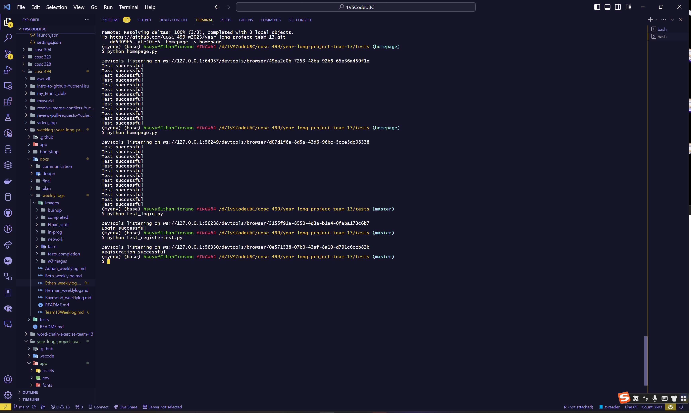

### Week 9 Oct 30 - Nov 5

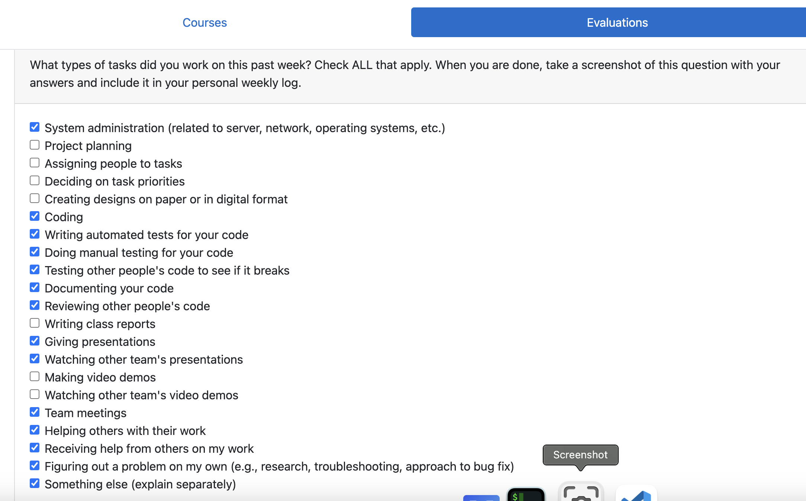

I focused on the preparation for the presentation. Finishing a last few things for the homepage and other functions. We also spent a while practicing the presentation. I also did a little bit of debugging for the CI-workflow in github actions. The remainder of my time this week was spent watching other teams present and giving them feedback.

### Week 10 Nov 6 - Nov 12

The features in the project plan I worked on this week were the AWS and CI-pipeline as well as the System architecture. The tasks associated are learning aws and setup, and system architecture. We have completed the UML diagram and basic mapping of the html linking. I have still not finished the pipeline yet, nor is the aws functional. This has been a huge learning curve and so much of my time this week has been reading internet sources to try and understand the problems I have been having.

A copy of the builds worked on this for the ci-pipeline and testing.
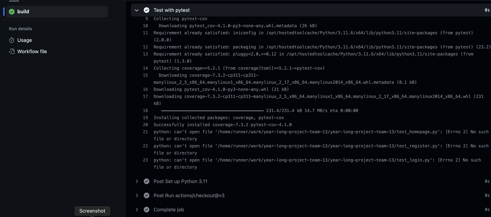

A copy of the best build that succeeded but is not finding the files
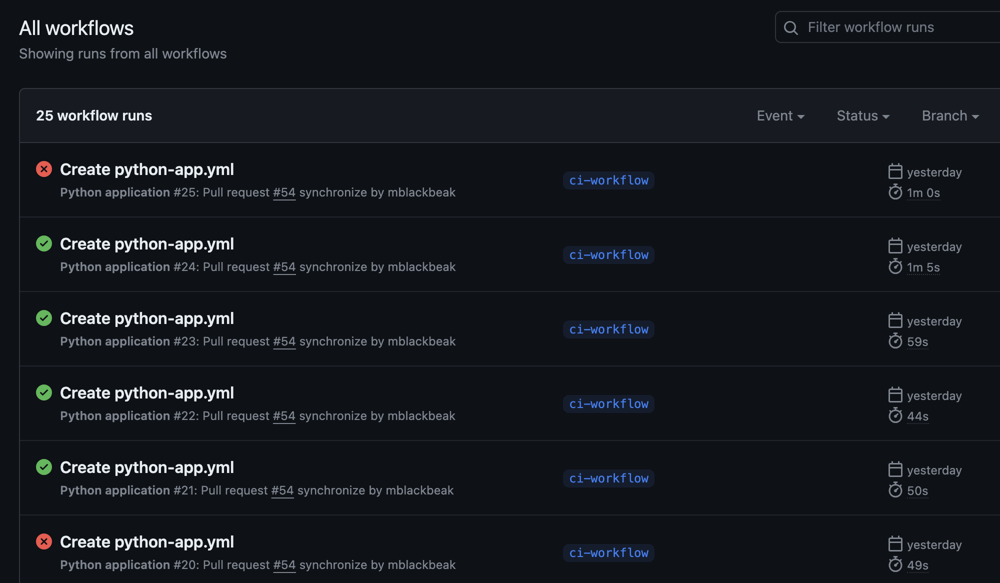

The html linking diagrams I worked on:
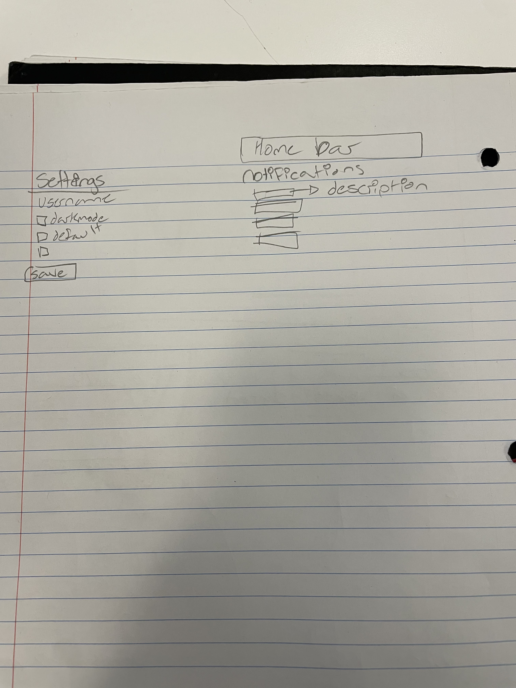
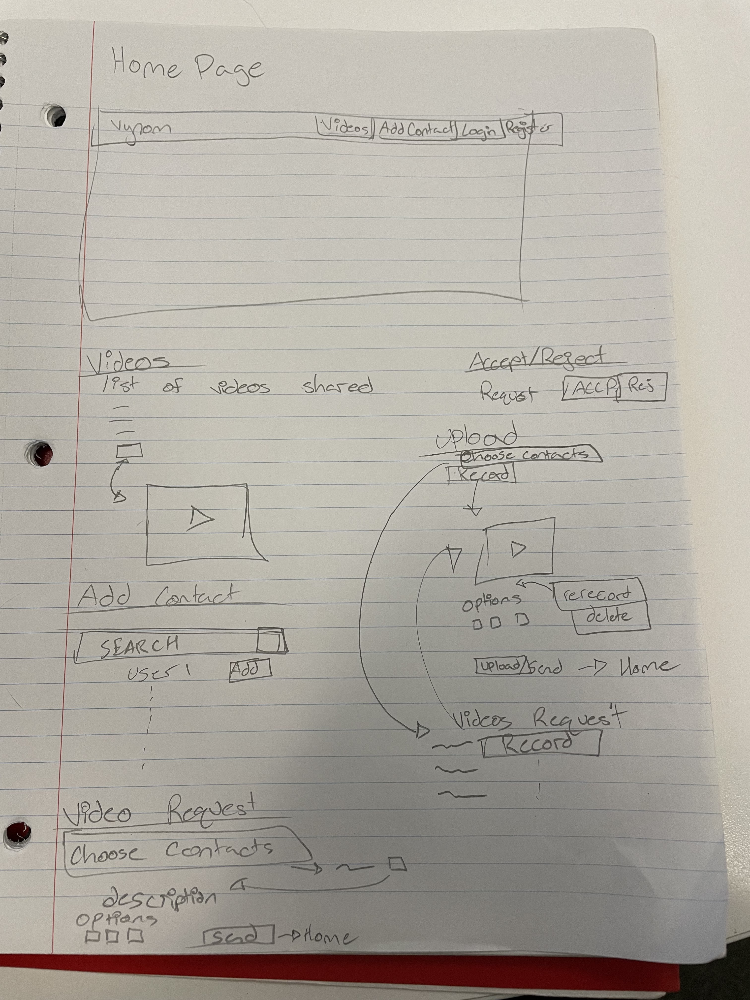

### Week 11/12 Nov 13 - Nov 25
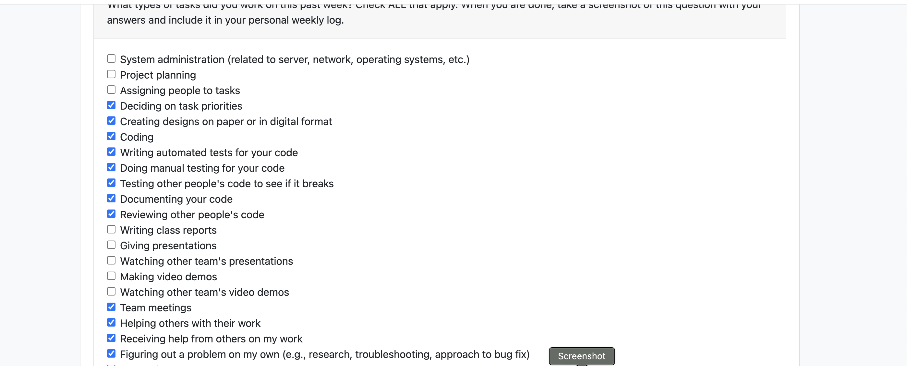

My features in the project plan for this milestone were aws and database and the UI for the Create Video page. On the task board these are called Learning AWS and Setup, CSS dev, User Interface Design, Bug Fixing, Database, and Create Video. I have spend approximately 18 hours on the aws database setup with lots and lots of bug fixing this week(s). It is still inprogress and not yet completed. I also spent a fair amount of time on the Create Video UI. The UI is completed and the tests are written but not yet passing. I also spent some time testing and reviewing other Ethan's and Adrian's code.

##### Here are some of the progress I made with Aws and the different erros that have come up so far.
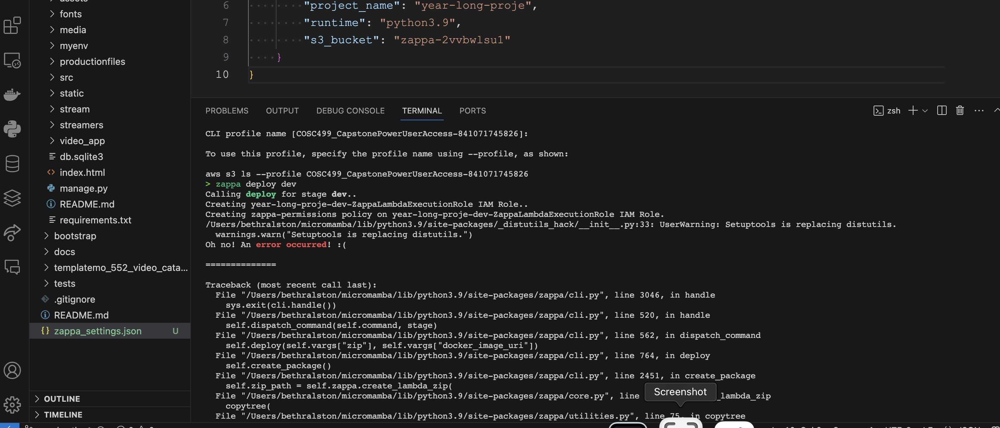
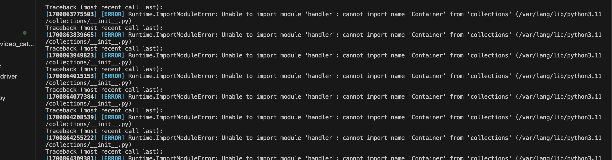
##### Current Output with AWS

##### Current Terminal Error
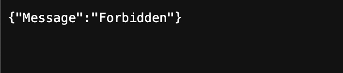
##### Create Video UI
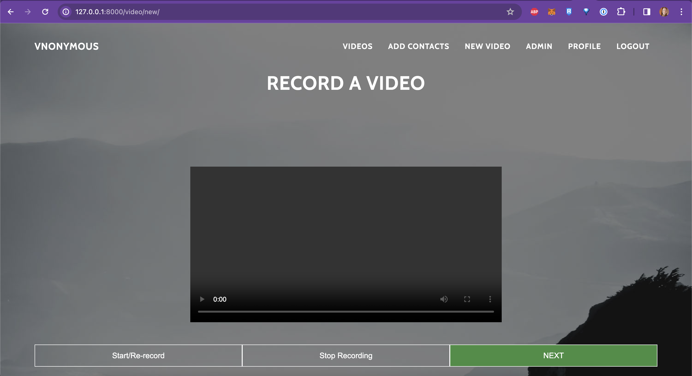
##### Test Report for my stuff
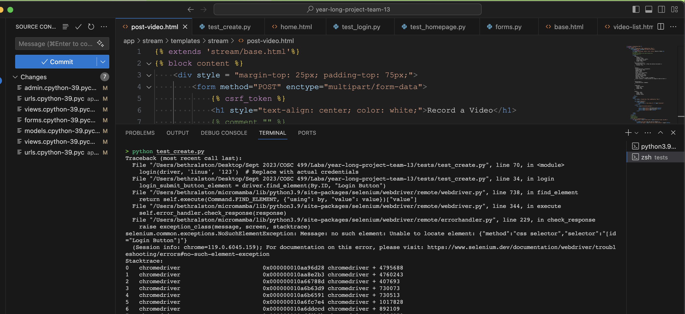

### Week 13 Nov 27 - Dec 3
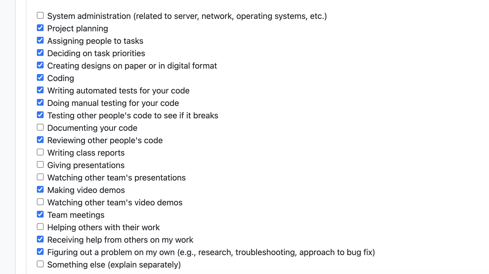

My features in the Project plan this week were the UI for Request Video and Create Video. As well as the Design Milestone document and video. On the board these were called Reqeust Video UI, Create Video UI and Design Milestone. I completed all three of these. I also wrote tests for both Request Video and Create Video (See team log for test report). I also spent some time reviewing and testing some of my team members code (See Closed Pull requests for reviews). As well, I spent a small amount of time fixing AWS. Finally, I also added a model to our current database to connect to the Request Video UI (See models.py and form.py for changes). It is connected but not fully functional yet. (All changes have been merged into master)

##### Request Video UI
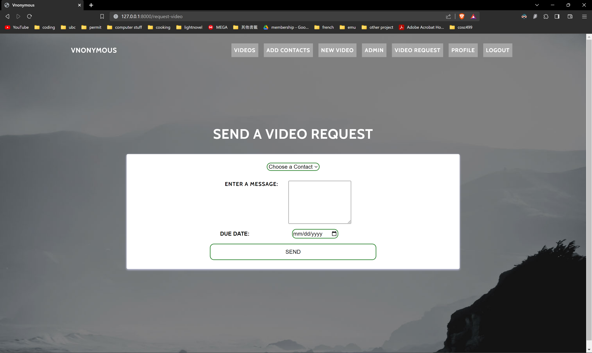

# Term 2

### Week 1 Jan 8 - 14
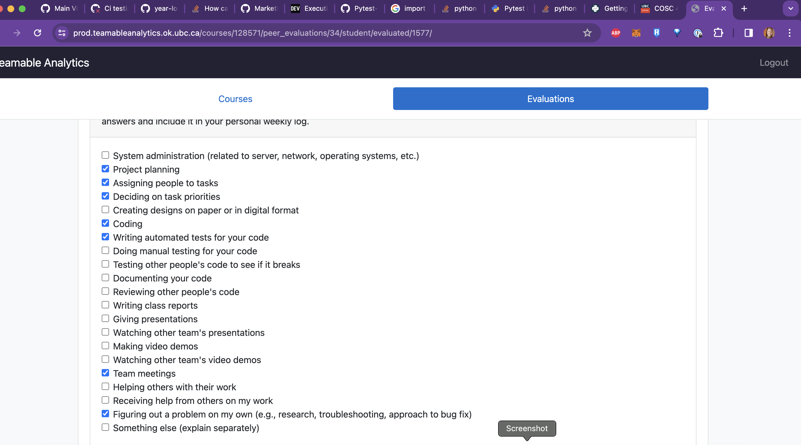

My feature this week was to work on the CI testing pipeline. This is associated with the CI Automated Testing task on the project board. This is still in progress as I spent the first little bit of this week to try and resolve problems. I then decided to restart with a simplier testing file and I rewrote the yml file. As well, I made an entirely new workflow for github actions. Currently I seem to have a problem with pytest itself and loading in the requirements on my computer.

#### Quick snap shot of the most recent error
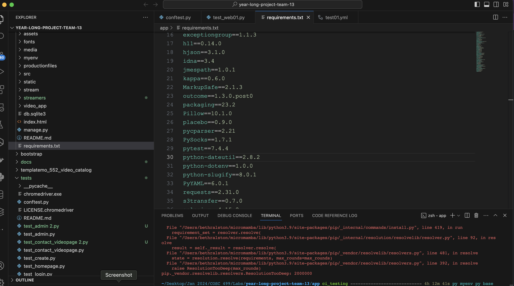
