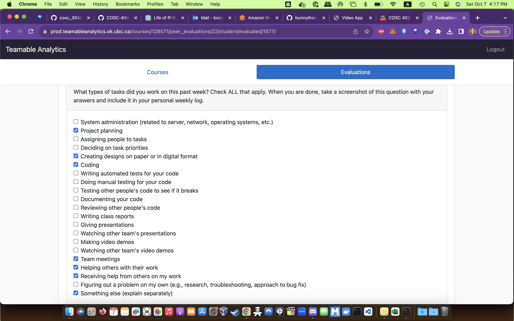

# Weekly Personal Log

### Week 4 Sept 25 - Oct 1

This week we all worked together to work on the Project plan. 

### Week 5 Oct 2 - Oct 8

This week was spent learning Django and becoming familiar with Python. I followed along with some online tutorials. This was for the learning django basics and set up. The following images are from the completion of the online tutorials.

### Week 6 Oct 9 - Oct 15

The setup and testing of the "Setting up the project Django base" on my computer. I also started working on the home page. I tried connecting the newly found html and css files to the basic set up of Django. The Setting up the project Django base is complete. The Home page is still in progress. I also started reading through a W3 school AWS tutorial to begin to be comfortable with AWS.

### Week 7 Oct 16 - 22

Completed the homepage css bug and linked all of the homepage buttons to their respective pages (That are still in progress or just empty html pages). Followed several aws tutorials and completed the aws amplify github connection guide. AWS was able to successfully build and deploy.

### Week 8 Oct 23 - 29

My features for this week was homepage and testing. On the project board they are called homepage. Homepage is now tested and in the done section. I also worked on presentation prep which is still in progess.
Finally, I also worked on implementing a CI Pipeline which is still in progress. 

Screen shot of presentation outline

Screen shot of most recent build with the pipline

Screen shot of all builds this week

Screen shot of homepage tests

