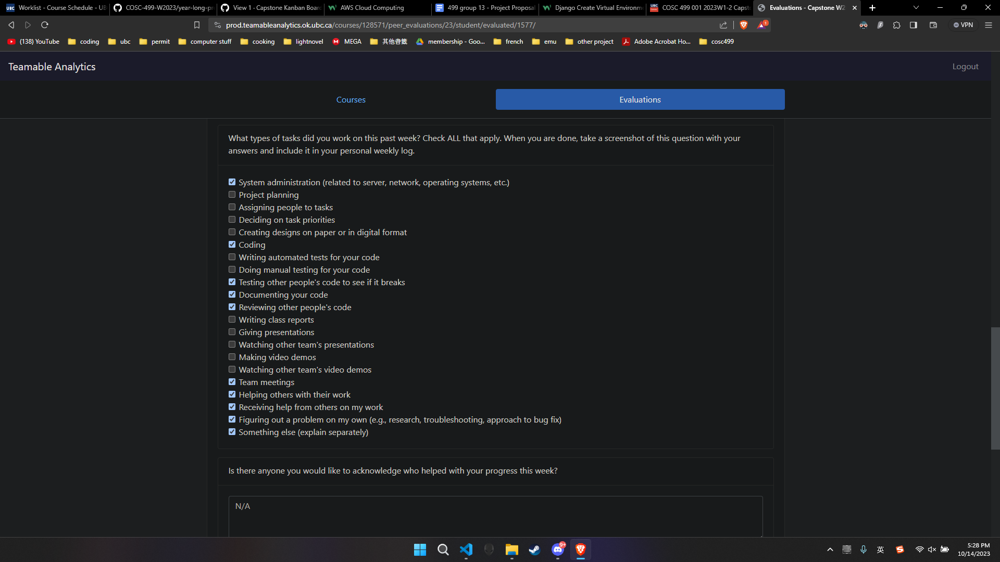
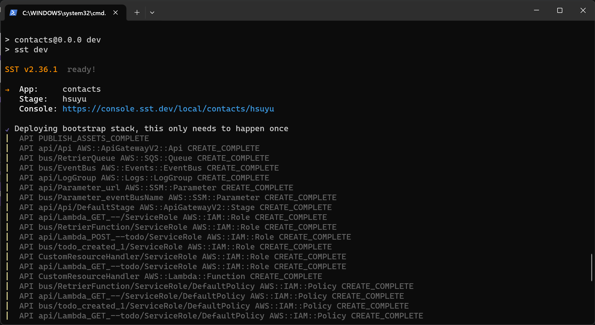
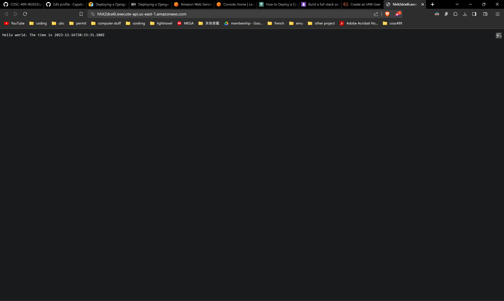
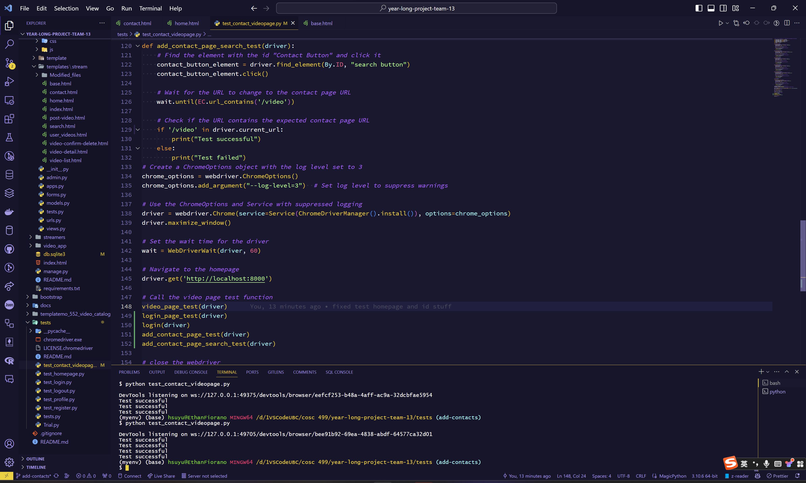
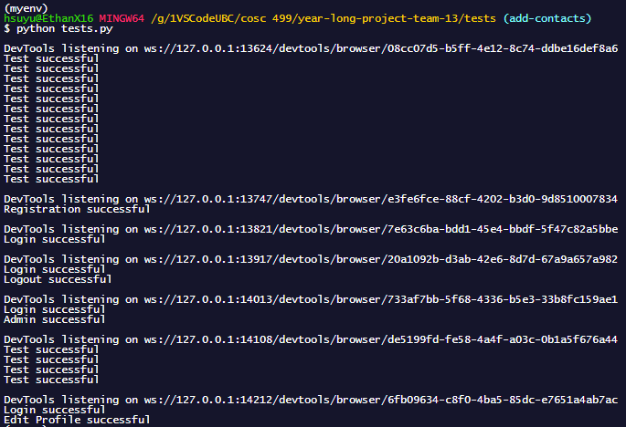

# Personal Week Log

- Applicable date range
- Type of tasks you worked on (screenshot from Peer Eval question)
- Recap on your week's goals-Which features were yours in the project plan for this milestone?
  - Which tasks from the project board are associated with these features?
  - Among these tasks, which have you completed/in progress in the last week?
  - Optional text: Additional context that we should be aware of

# Preferred name -> Ssc name -> Github name

- Ethan -> Ethan Hsu -> YuchenHsu

## Week 4 2023/09/25~2023/10/1

- Type of tasks you worked on (screenshot from Peer Eval question)

- This week, we worked on the project plan and made sure to distribute the work evenly.

# Preferred name -> Ssc name -> Github name

- Ethan -> Ethan Hsu -> YuchenHsu

## Week 5 2023/10/02~2023/10/08

- Type of tasks you worked on (screenshot from Peer Eval question)

- This week, I learned the basics of Django, making a simple exercise website. And searched for the template to be used for our project.
- The Tasks associated and completed is the *Learning Django basics and setup* task.
- Optional Text: The following images are from my practice website for Django
- Django Practice Website Homepage
  
- Django Practice Website Member List
  
- Django Practice Website Member Detail
  
- Django Practice Website Admin Page
  

# Preferred name -> Ssc name -> Github name

- Ethan -> Ethan Hsu -> YuchenHsu

## Week 6 2023/10/09 ~ 2023/10/15

- Type of tasks you worked on (screenshot from Peer Eval question)

- This week, me and the team started working on implementing the template for our project. We also chose our css/html template and started incorperating it into the django website we made.
- The task associated is "[Setting up the project Django base](https://github.com/COSC-499-W2023/year-long-project-team-13/issues/45)"**,** "[Home Page](https://github.com/COSC-499-W2023/year-long-project-team-13/issues/3)", "[CSS dev](https://github.com/COSC-499-W2023/year-long-project-team-13/issues/7)", "[User Interface Design](https://github.com/COSC-499-W2023/year-long-project-team-13/issues/6)".
- Optional Text: The following images are from the Django website template and the css template we chose. And the combining in progress.
- Django Website Template
  
- CSS Template
  
- Combining
  

# Preferred name -> Ssc name -> Github name

- Ethan -> Ethan Hsu -> YuchenHsu

## Week 7 2023/10/16 ~ 2023/10/22

- Type of tasks you worked on (screenshot from Peer Eval question)

- This week, I finished the homepage of the website. And the linking of the pages. So far, all the buttons link to their respective pages.

# Preferred name -> Ssc name -> Github name

- Ethan -> Ethan Hsu -> YuchenHsu

## Week 8 2023/10/23 ~ 2023/10/29

- Type of tasks you worked on (screenshot from Peer Eval question)

- This week, I worked on making the home page look better, creating the logo for our project, and making the test for homepage to make sure it links to all the other pages and tested with Selenium.
- The following images are the logo and the test for homepage respectively.
  - Logo

  - Test

# Preferred name -> Ssc name -> Github name

- Ethan -> Ethan Hsu -> YuchenHsu

## Week 9 2023/10/30 ~ 2023/11/05

- Type of tasks you worked on (screenshot from Peer Eval question)

- This week, I worked on refining the homepage test, and preparing for the presentation. I also worked on making sure the website top bar is consistent across all pages and displays the correct group name.
- I also helped with trying to figure
- The following images are the test for homepage.
  - Test

  - Test video

  - Presentation Prep

# Preferred name -> Ssc name -> Github name

- Ethan -> Ethan Hsu -> YuchenHsu

## Week 10 2023/11/06 ~ 2023/11/12

- Type of tasks you worked on (screenshot from Peer Eval question)

#### Did not save on the website so the TA cannot see the result.

- This week, I worked on making the UML diagram and also tried to host the project on AWS.
  - So far I have tried EC2, which is still in progress figuring out problems, Elastic Beanstalk, which doesn't like my login credentials, and Lambda, which I can't figure out how to install the dependencies without breaking the other stuff.
- The guides I tried includes the following:
  - [AWS Lambda](https://dev.to/vaddimart/deploy-django-app-on-aws-lambda-using-serverless-part-1-1i90)
  - [AWS Elastic Beanstalk](https://docs.aws.amazon.com/elasticbeanstalk/latest/dg/create-deploy-python-django.html)
  - [AWS EC2](https://blog.devgenius.io/how-to-deploy-a-django-project-on-an-amazon-ec2-instance-with-apache-875f925d0a9a)
- The following images are the UML diagram and the AWS stuff.
  - UML

  - AWS

# Preferred name -> Ssc name -> Github name

- Ethan -> Ethan Hsu -> YuchenHsu

## Week 11~12 2023/11/13 ~ 2023/11/26

- Type of tasks you worked on (screenshot from Peer Eval question)

- For week 11. I tried to host the website on AWS but had no success. Which took the entire week. For week 12, I worked on making the video list page look better, and also changed the add contacts page to make it more intuitive.
- The tasks associated are the following:

  - [Learning AWS and setup](https://github.com/COSC-499-W2023/year-long-project-team-13/issues/41)
  - [User Interface Design](https://github.com/COSC-499-W2023/year-long-project-team-13/issues/6)
  - [Add contact](https://github.com/COSC-499-W2023/year-long-project-team-13/issues/27)
  - [Github Pull Request For the Contact Page and Video List Page](https://github.com/COSC-499-W2023/year-long-project-team-13/pull/74)
  - [Github Pull Request I reviewed](https://github.com/COSC-499-W2023/year-long-project-team-13/pull/69)
- The following images are for the trials on AWS and the code I did for the Contact Page and the Video List Page.
  - AWS with SST: For this option, I was only able to make it host a dummy website, but not our project.
    
    
    
    
  - AWS EC2: For this one, I managed to have the virtual machine run our code and host the website, but I cannot access it from the internet. I tried to change the security group to allow all traffic, but it still doesn't work.
    
    
- These are images of the code I did on the Contact Page and the Video List Page
  - Contact Page
    
  - Video List Page
    
  - This is the test report for both the Contact Page and the Video List Page
    
  - This is the test report for the entire website
    
