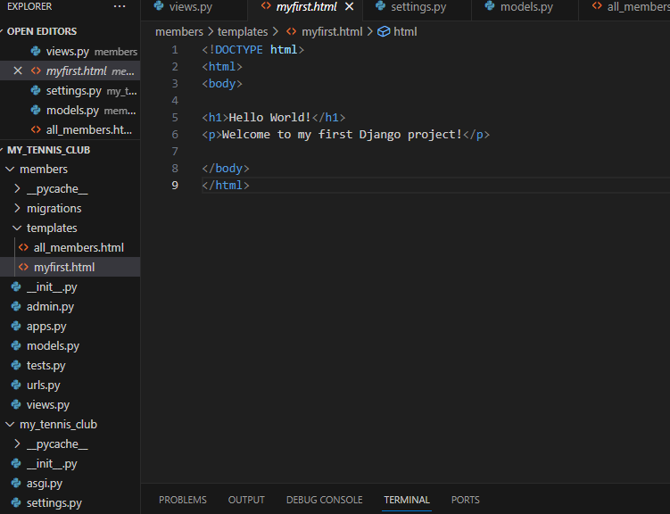

# Personal Week Log

- Applicable date range
##  Week 4 2023/09/25~2023/10/1
- Type of tasks you worked on (screenshot from Peer Eval question)

# Preferred name -> Ssc name -> Github name

- Herman -> Herman Sood -> Herman Sood

- Recap on your week's goals-Which features were yours in the project plan for this milestone? This week I worked with my team to work on the project plan.
 
  - Which tasks from the project board are associated with these features?
  The project plan.
  
  - Among these tasks, which have you completed/in progress in the last week?
  The project plan.

  - Optional text: Additional context that we should be aware of

  # Personal Week Log

- Applicable date range
##  Week 5 2023/10/1~2023/10/7
- Type of tasks you worked on (screenshot from Peer Eval question)

# Preferred name -> Ssc name -> Github name

- Herman -> Herman Sood -> Herman Sood

- Recap on your week's goals-Which features were yours in the project plan for this milestone? This week I worked on learning the basics of the framework Django and did some setup of it.
 
  - Which tasks from the project board are associated with these features?
  Learning Django basics and setup
  
  - Among these tasks, which have you completed/in progress in the last week?
  Learning Django basics and setup

  - Optional text: Additional context that we should be aware of

  
  

# Personal Week Log

- Applicable date range
##  Week 6 2023/10/8~2023/10/14
- Type of tasks you worked on (screenshot from Peer Eval question)

# Preferred name -> Ssc name -> Github name

- Herman -> Herman Sood -> Herman Sood

- Recap on your week's goals-Which features were yours in the project plan for this milestone? This week I worked on the project Django base setup with things like the Django environment files, connected homepage.html with the Django website, and implemented some CSS to the homepage. 
 
  - Which tasks from the project board are associated with these features?
  Setting up the project Django base and CSS dev. 
  - Among these tasks, which have you completed/in progress in the last week?
  Setting up the project Djang base (completed), CSS dev (in progress)

