## Personal Week Log

- Applicable date range
- Type of tasks you worked on (screenshot from Peer Eval question)
- Recap on your week's goals
- Which features were yours in the project plan for this milestone?
- Which tasks from the project board are associated with these features?
- Among these tasks, which have you completed/in progress in the last week?
- Optional text: Additional context that we should be aware of\

# Preferred name -> Ssc name -> Github name

- Raymond -> Sitt Paing -> SittHmuePaing

## Week 4 2023/09/25~2023/10/1

-Types of tasks that I have worked on

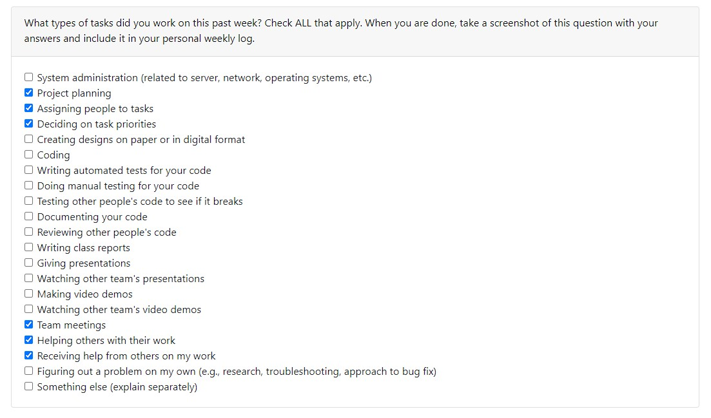

## Recap of week's goals
I collaborate with my team to discuss and work on the project plan, team weekly log and completed my personal weekly log.

## Week 5 2023/10/02~2023/10/08

-Types of tasks that I have worked on

## Recap of week's goals
I collaborate with my team to discuss on the project templates we would like to use and learn a new framework django and work on the setup to use for our project from W3schools.com. I also worked on my weeklylog and contribute in teamlog for this week.

-Optional text: Below are some images of practice i have done using Django

-Django coding
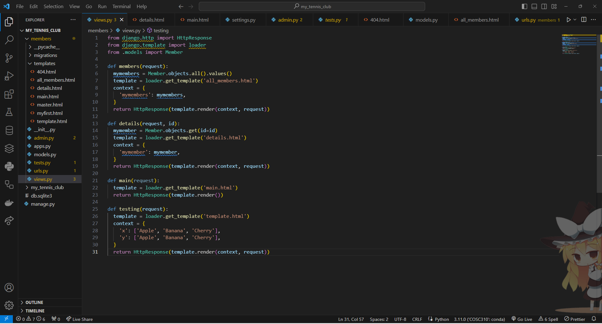
-The list of members

-Home page for Admin

-The list of members on admin page(after practicing adding and deleting members)
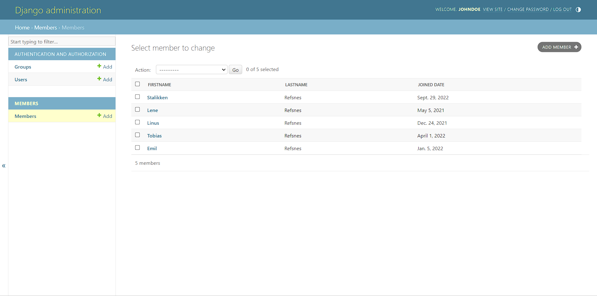

## Week 6 2023/10/09 ~ 2023/10/15

-Types of tasks that I have worked on

## Recap of week's goals
For this week, we started working on the html/css template that we choose for our project previously and do implementation in the django website that our team made. I also contribute in resolving the issue where django is not loading the css by searching different online resources.

## Week 7 2023/10/16 ~ 2023/10/21

-Types of tasks that I have worked on

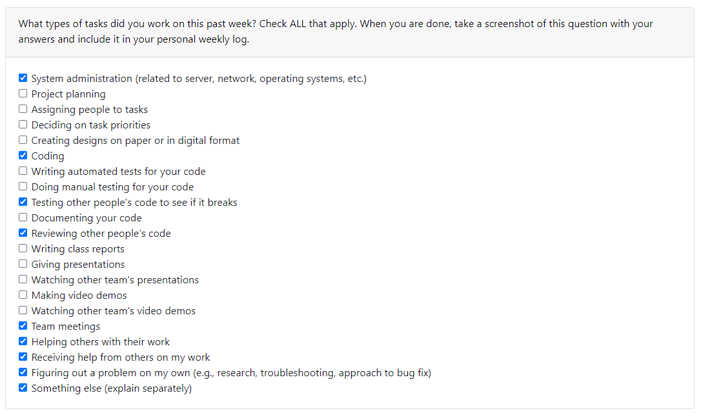

## Recap of week's goals
For this week, I worked on html/css template for the login and video page, and also help my team to fix bugs and issues by searching for online solution and utilize them when we are working on the templates. 

## Week 8 2023/10/22 ~ 2023/10/28

-Types of tasks that I have worked on

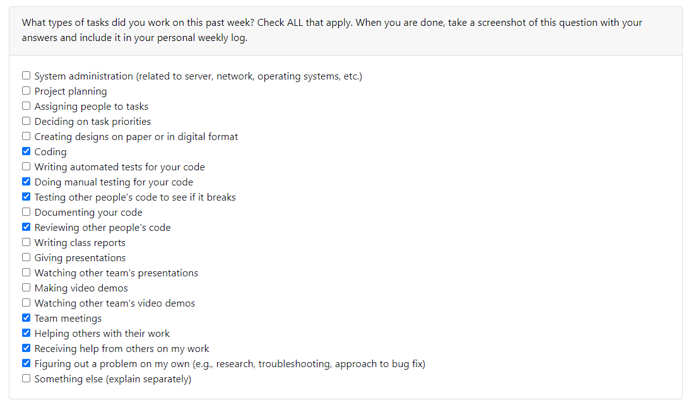

## Recap of week's goals
For this week, we worked on the login/register page making changes to html/css and work on the function of the login and register pages. Also we tested the code frequently to see whether the website return the output that we are expecting to see. I also work on the test code for the login page to check whether the login is successful or not. Any bugs and issues that have arises during coding is also fixed along the way when working on the website through searching online for external resources to tackle the problems.

Register Page
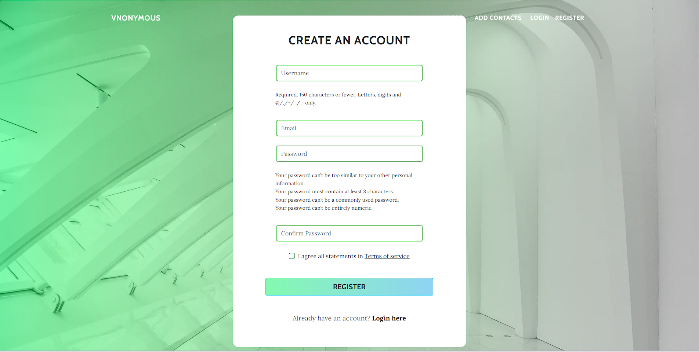

Login Page
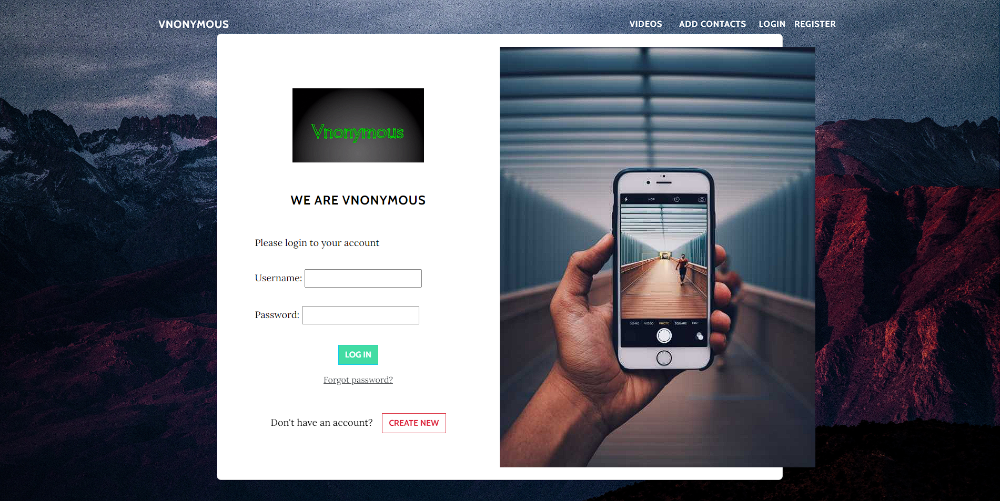

Login Testing
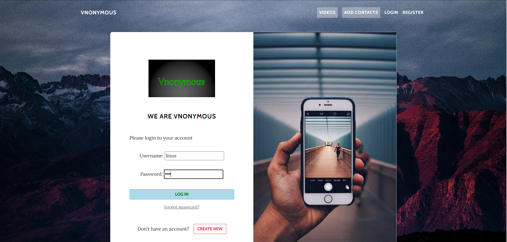

Login Testing Successful
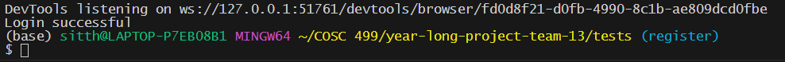

## Week 9 2023/10/22 ~ 2023/10/28

-Types of tasks that I have worked on

## Recap of week's goals
For this week, we worked on our presentation as well as prepare for a live demo for our presentation. We also fixed any existing bugs and issues when doing the live demo and make changes/fix the html/css of the pages(profile, login and logout). We also made preparation on the google docs for the presentation on what we want to present. 

Profile Page
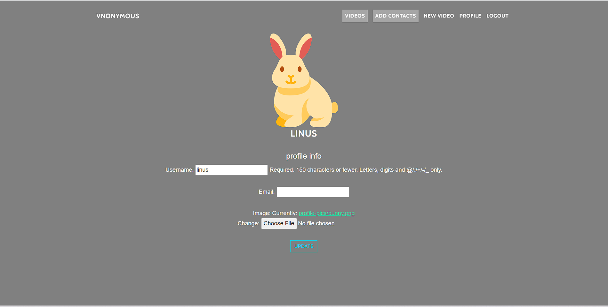

Login Page

Login Testing

Login Testing Successful

Presentation Prep
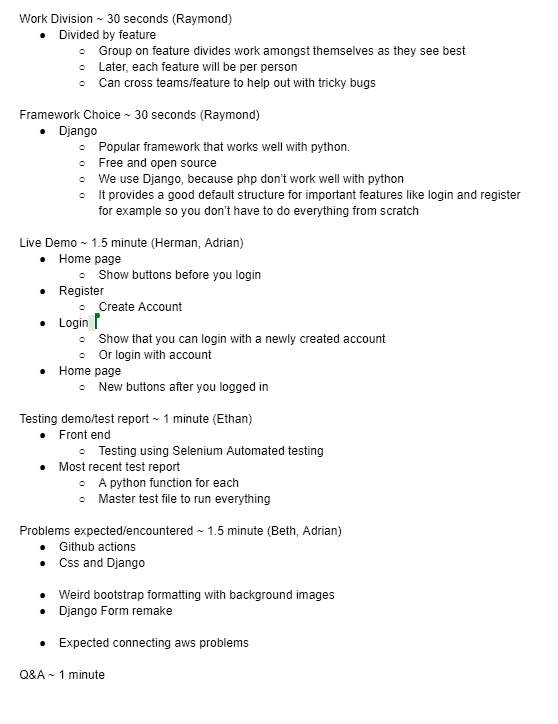

My Presentation Part
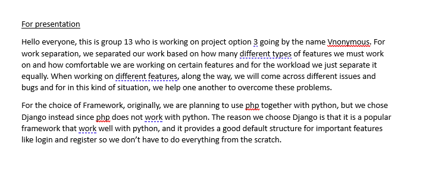

