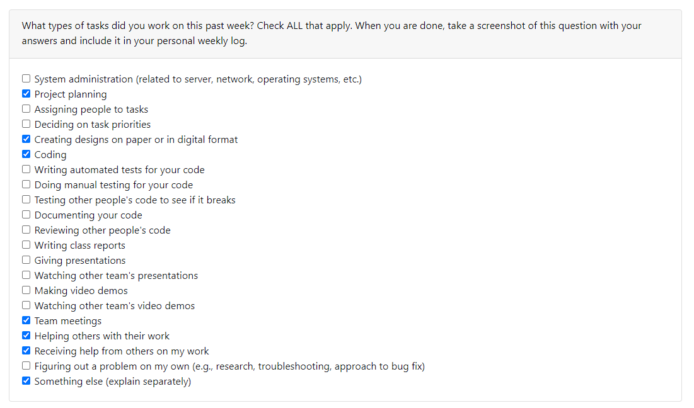
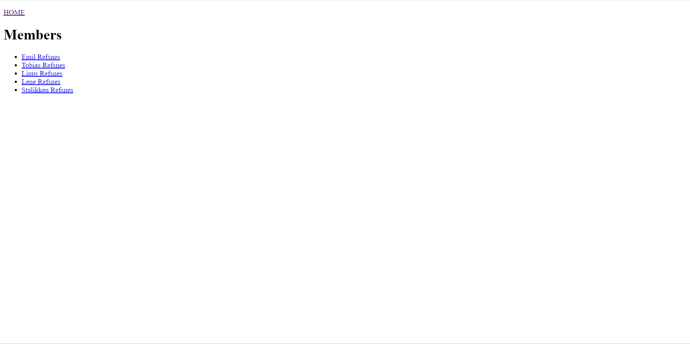
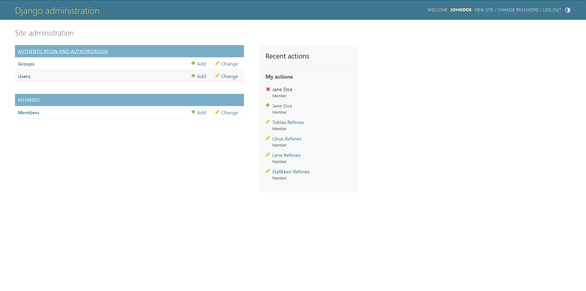

## Personal Week Log

- Applicable date range
- Type of tasks you worked on (screenshot from Peer Eval question)
- Recap on your week's goals
- Which features were yours in the project plan for this milestone?
- Which tasks from the project board are associated with these features?
- Among these tasks, which have you completed/in progress in the last week?
- Optional text: Additional context that we should be aware of\

# Preferred name -> Ssc name -> Github name

- Raymond -> Sitt Paing -> SittHmuePaing

## Week 4 2023/10/1-2023/10/7

-Types of tasks that I have worked on

## Recap of week's goals
I collaborate with my team to discuss and work on the project plan, team weekly log and completed my personal weekly log.

## Week 5 2023/09/25-2023/10/1

-Types of tasks that I have worked on

## Recap of week's goals
I collaborate with my team to discuss on the project templates we would like to use and learn a new framework django and work on the setup to use for our project from W3schools.com. I also worked on my weeklylog and contribute in teamlog for this week.

-Optional text: Below are some images of practice i have done using Django

-Django coding

-The list of members

-Home page for Admin

-The list of members on admin page(after practicing adding and deleting members)

