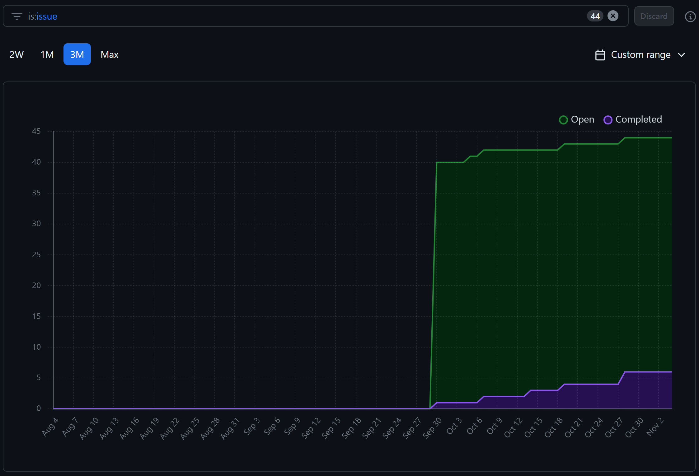

# Expected

- Team name with work performed start date to end date
- Recap your milestone goals:
  - Which features were in the project plan for this milestone?
  - Which tasks from the project board are associated with these features?
- Burnup chart (velocity)-Quick reminder of username → student name
- Table view of completed tasks on project board (by which username)
- Table view of in progress tasks on project board (by which username)
- Test report
- Optional text: Additional context that we should be aware of
-

## Preferred name -> Ssc name -> Github name

- Ethan -> Ethan Hsu -> YuchenHsu
- Beth -> Beth Ralston -> mblackbeak
- Herman -> Herman Sood -> herman-23
- Raymond -> Sitt Paing -> SittHmuePaing
- Adrian -> Adrian Fong -> AdrianFWM

## Week 4 2023/09/25~2023/10/1

- Which features were in the project plan for this milestone?
  - We worked on the project plan and made sure to distribute the work evenly.
- Which tasks from the project board are associated with these features?
  - The project plan is called **Project Plan** on the Kanban board.

Burnup chart

Network Graph

Completed Tasks

In progress Tasks

Tests

- Tests: We don't have any code this week so there's no tests to run.

## Preferred name -> Ssc name -> Github name

- Ethan -> Ethan Hsu -> YuchenHsu
- Beth -> Beth Ralston -> mblackbeak
- Herman -> Herman Sood -> herman-23
- Raymond -> Sitt Paing -> SittHmuePaing
- Adrian -> Adrian Fong -> AdrianFWM

## Week 5 2023/10/02~2023/10/08

- Which features were in the project plan for this milestone?
  - We worked on learning the basics and setup of our tech stack, namely Django. Each of us created our own local website and made sure that we could run it.
- Which tasks from the project board are associated with these features?
  - The task is called **Learning django basics and setup.**

Burnup chart

Network Graph

Completed Tasks

In progress Tasks

Tests

- Tests: We don't have any project code this week so there's no tests to run.

Optional Text:

- The bulk of this week's project progression is on individual learning of the django framework by following the online tutorial [W3School Django Tutorial](https://www.w3schools.com/django/index.php).
- The results of each of the team members' websites are in the individual logs.

## Preferred name -> Ssc name -> Github name

- Ethan -> Ethan Hsu -> YuchenHsu
- Beth -> Beth Ralston -> mblackbeak
- Herman -> Herman Sood -> herman-23
- Raymond -> Sitt Paing -> SittHmuePaing
- Adrian -> Adrian Fong -> AdrianFWM

## Week 6 2023/10/9 ~ 2023/10/15

- Which features were in the project plan for this milestone?
  - We worked on setting up the basic framework of a Django website and implemented some parts of css.
  - We searched for and decided on the template we want to use for html and css.
  - We started combining the css template with the Django website.
- Which tasks from the project board are associated with these features?
  - We completed "[Setting up the project Django base](https://github.com/COSC-499-W2023/year-long-project-team-13/issues/45)"**.**
  - We started on "[Home Page](https://github.com/COSC-499-W2023/year-long-project-team-13/issues/3)", "[CSS dev](https://github.com/COSC-499-W2023/year-long-project-team-13/issues/7)", "[User Interface Design](https://github.com/COSC-499-W2023/year-long-project-team-13/issues/6)".

Burnup chart

Network Graph

Completed Tasks

In progress Tasks

## Preferred name -> Ssc name -> Github name

- Ethan -> Ethan Hsu -> YuchenHsu
- Beth -> Beth Ralston -> mblackbeak
- Herman -> Herman Sood -> herman-23
- Raymond -> Sitt Paing -> SittHmuePaing
- Adrian -> Adrian Fong -> AdrianFWM

## Week 7 2023/10/16 ~ 2023/10/22

- Which features were in the project plan for this milestone?
  - We worked on homepage, login and create account as well as started learning and setting up AWS.
- Which tasks from the project board are associated with these features?
  - We completed [Home Page](https://github.com/COSC-499-W2023/year-long-project-team-13/issues/3).
  - We started on [Login](https://github.com/COSC-499-W2023/year-long-project-team-13/issues/5), [Create account](https://github.com/COSC-499-W2023/year-long-project-team-13/issues/8), and [Learning AWS and setup](https://github.com/COSC-499-W2023/year-long-project-team-13/issues/41).

Burnup chart

Network Graph

Completed Tasks

In progress Tasks

## Preferred name -> Ssc name -> Github name

- Ethan -> Ethan Hsu -> YuchenHsu
- Beth -> Beth Ralston -> mblackbeak
- Herman -> Herman Sood -> herman-23
- Raymond -> Sitt Paing -> SittHmuePaing
- Adrian -> Adrian Fong -> AdrianFWM

## Week 8 2023/10/23 ~ 2023/10/29

- Which features were in the project plan for this milestone?
  - We worked on making the homepage look better and finished the login and create account pages.
  - We also made sure to test everything.
- Which tasks from the project board are associated with these features?
  - We completed [Login](https://github.com/COSC-499-W2023/year-long-project-team-13/issues/5), [Create account](https://github.com/COSC-499-W2023/year-long-project-team-13/issues/8), and refined [Home Page](https://github.com/COSC-499-W2023/year-long-project-team-13/issues/3).

Burnup chart

Network Graph

Completed Tasks

In progress Tasks

Test Report

## Preferred name -> Ssc name -> Github name

- Ethan -> Ethan Hsu -> YuchenHsu
- Beth -> Beth Ralston -> mblackbeak
- Herman -> Herman Sood -> herman-23
- Raymond -> Sitt Paing -> SittHmuePaing
- Adrian -> Adrian Fong -> AdrianFWM

## Week 9 2023/10/30 ~ 2023/11/05

- Which features were in the project plan for this milestone?
  - This week, we worked on making the presentation and preparing live demo for the presentation.
  - We also finished the testing code for the login, create account pages and homepage.
  - Changed some tests and CSS before the presentation.
- Which tasks from the project board are associated with these features?
  - We completed [Presentation Prep](https://github.com/COSC-499-W2023/year-long-project-team-13/issues/49) and started working on [Profile](https://github.com/COSC-499-W2023/year-long-project-team-13/issues/57), [Edit profile](https://github.com/COSC-499-W2023/year-long-project-team-13/issues/9) and [CSS dev](https://github.com/COSC-499-W2023/year-long-project-team-13/issues/7).

Burnup chart

Network Graph

Completed Tasks

In progress Tasks

Test Report

## Preferred name -> Ssc name -> Github name

- Ethan -> Ethan Hsu -> YuchenHsu
- Beth -> Beth Ralston -> mblackbeak
- Herman -> Herman Sood -> herman-23
- Raymond -> Sitt Paing -> SittHmuePaing
- Adrian -> Adrian Fong -> AdrianFWM

## Week 10 2023/11/06 ~ 2023/11/12

- Which features were in the project plan for this milestone?
  - This week, we worked on making the UML diagram and the profile page, and also continued working on the CI for github.
  - We also started trying to host our project on AWS.
- Which tasks from the project board are associated with these features?
  - We are still working on [Edit profile](https://github.com/COSC-499-W2023/year-long-project-team-13/issues/9)

Burnup chart

Network Graph

Completed Tasks

In progress Tasks

Test Report

Optional Text:

- The following image is the uml diagram we made for our project.
  

## Preferred name -> Ssc name -> Github name

- Ethan -> Ethan Hsu -> YuchenHsu
- Beth -> Beth Ralston -> mblackbeak
- Herman -> Herman Sood -> herman-23
- Raymond -> Sitt Paing -> SittHmuePaing
- Adrian -> Adrian Fong -> AdrianFWM

## Week 11~12 2023/11/13 ~ 2023/11/26

- Which features were in the project plan for this milestone?
  - This week, we worked on making the profile page, admin page and the notification page.
  - We also worked on making the create video page, the video list page and the add contact page look better.
  - We have also started working on the Settings page, Logout UI.
  - We also tried to host our project on AWS, but we ran into some problems and that one is still in progress.
- Which tasks from the project board are associated with these features?
  - We completed [Profile](https://github.com/COSC-499-W2023/year-long-project-team-13/issues/57), [Edit profile](https://github.com/COSC-499-W2023/year-long-project-team-13/issues/9) and [Admin](https://github.com/COSC-499-W2023/year-long-project-team-13/issues/11).
  - We are still working on [Learning AWS and setup](https://github.com/COSC-499-W2023/year-long-project-team-13/issues/41), [System architecture](https://github.com/COSC-499-W2023/year-long-project-team-13/issues/4) and [Settings](https://github.com/COSC-499-W2023/year-long-project-team-13/issues/10).
- This week's respective pull requests are:
  - [Admin page complete](https://github.com/COSC-499-W2023/year-long-project-team-13/pull/69)
  - [Edit Profile Testing complete, updated other test files](https://github.com/COSC-499-W2023/year-long-project-team-13/pull/70)
  - [logout and logout test](https://github.com/COSC-499-W2023/year-long-project-team-13/pull/71)
  - [Admin test updated](https://github.com/COSC-499-W2023/year-long-project-team-13/pull/72)
  - [Add contacts](https://github.com/COSC-499-W2023/year-long-project-team-13/pull/74)

Burnup chart

Network Graph

Completed Tasks

In progress Tasks

Test Report

## Preferred name -> Ssc name -> Github name

- Ethan -> Ethan Hsu -> YuchenHsu
- Beth -> Beth Ralston -> mblackbeak
- Herman -> Herman Sood -> herman-23
- Raymond -> Sitt Paing -> SittHmuePaing
- Adrian -> Adrian Fong -> AdrianFWM

## Week 13 2023/11/27 ~ 2023/12/03

- Which features were in the project plan for this milestone?
  - This week, we merged all the main branches into the master branch and made sure that everything works. And made sure that the tests all pass.
  - We also planned for the diagrams and the presentation video.
  - Video request page UI is finished and testing is done.
  - Video Create page test is done.

Burnup chart

Network Graph

Completed Tasks

In progress Tasks

Test Report

